# Методические указания по работе с ROS2
## по курсу «Основы робототехники»

------------------------------------------------------------------------

## Содержание
  - [Введение](#введение)
  - [1. CLI (Command Line Interface) инструменты](#1-cli-command-line-interface-инструменты)
    - [1.1 Настройка окружения](#11-настройка-окружения)
    - [1.2 Использование turtlesim, ros2 и rqt](#12-использование-turtlesim-ros2-и-rqt)
    - [1.3 Понимание узлов](#13-понимание-узлов)
    - [1.4 Понимание топиков](#14-понимание-топиков)
      - [1.4.1 rqt\_graph](#141-rqt_graph)
      - [1.4.2 ros2 topic list](#142-ros2-topic-list)
      - [1.4.3 ros2 topic echo](#143-ros2-topic-echo)
      - [1.4.4 ros2 topic info](#144-ros2-topic-info)
      - [1.4.5 ros2 interface show](#145-ros2-interface-show)
      - [1.4.6 ros2 topic pub](#146-ros2-topic-pub)
      - [1.4.7 ros2 topic hz](#147-ros2-topic-hz)
      - [1.4.8 ros2 topic bw](#148-ros2-topic-bw)
      - [1.4.9 ros2 topic find](#149-ros2-topic-find)
    - [1.5 Понимание сервисов](#15-понимание-сервисов)
      - [1.5.1 Типы сервисов и команды для них](#151-типы-сервисов-и-команды-для-них)
    - [1.6 Понимание параметров](#16-понимание-параметров)
    - [1.7 Понимание действий](#17-понимание-действий)
    - [1.8 Использование rqt\_console](#18-использование-rqt_console)
    - [1.9 Запуск узлов](#19-запуск-узлов)
    - [1.10 Запись и воспроизведение данных](#110-запись-и-воспроизведение-данных)
  - [2 Базовые клиентские библиотеки](#2-базовые-клиентские-библиотеки)
    - [2.1 Создание рабочего пространства](#21-создание-рабочего-пространства)
    - [2.2 Использование colcon для сборки пакетов](#22-использование-colcon-для-сборки-пакетов)
    - [2.3 Создание пакета](#23-создание-пакета)
    - [2.4 Написание простого издателя и подписчика (C++)](#24-написание-простого-издателя-и-подписчика-c)
    - [2.5 Написание простого издателя и подписчика (Python)](#25-написание-простого-издателя-и-подписчика-python)
    - [2.6 Написание простого сервиса и клиента (C++)](#26-написание-простого-сервиса-и-клиента-c)
      - [2.6.1 Обновление package.xml](#261-обновление-packagexml)
      - [2.6.2 Написание узла службы](#262-написание-узла-службы)
      - [2.6.3 Добавление исполняемого файла](#263-добавление-исполняемого-файла)
      - [2.6.4 Создание клиентского узла](#264-создание-клиентского-узла)
      - [2.6.5 Добавление исполняемого файла](#265-добавление-исполняемого-файла)
    - [2.7 Написание простого сервиса и клиента (Python)](#27-написание-простого-сервиса-и-клиента-python)
    - [2.8 Создание пользовательских файлов msg и srv](#28-создание-пользовательских-файлов-msg-и-srv)
    - [2.9 Реализация пользовательских интерфейсов](#29-реализация-пользовательских-интерфейсов)
    - [2.10 Использование параметров ROS в классе Python](#210-использование-параметров-ros-в-классе-python)
    - [2.11 Использование ros2doctor для поиска проблем](#211-использование-ros2doctor-для-поиска-проблем)
  - [3 Повышенный уровень](#3-повышенный-уровень)
    - [3.1 Управление зависимостями с помощью rosdep](#31-управление-зависимостями-с-помощью-rosdep)
    - [3.2 Создание действия](#32-создание-действия)
    - [3.3 Написание сервера и клиента действий на Python](#33-написание-сервера-и-клиента-действий-на-python)
  - [Заключение](#заключение)

------------------------------------------------------------------------

## Введение

Данная работа представляет собой развернутый отчет, содержащий
методические рекомендации по работе с ROS2.

ROS2 (Robot Operating System 2) - это программная экосистема для
создания распределённых робототехнических приложений, в которой
функциональность оформляется в виде узлов (nodes), а обмен данными
организован через: - топики (topics) - сервисы (services) - действия
(actions) - параметры (parameters)

Методическая цель документа - не только перечислить команды и примеры
кода, но и зафиксировать логическую последовательность работы: 
- настройка окружения,
- построение рабочей области,
- разработка пакетов,
- реализация узлов,
- подключение пользовательских интерфейсов,
- диагностика и воспроизведение данных.

------------------------------------------------------------------------

## 1. CLI (Command Line Interface) инструменты

В данном разделе собраны базовые инструменты командной строки ROS2 и
практические действия, позволяющие быстро поднять систему, увидеть
структуру графа и проверить корректность обмена данными.

Далее последовательно рассматриваются материалы учебных файлов, входящих
в раздел *Beginner CLI tools*.

------------------------------------------------------------------------

## 1.1 Настройка окружения

Цель данного подраздела - настроить окружение ROS2 для работы.

ROS2 основывается на идее комбинирования рабочих пространств.

**Рабочее пространство (Workspace)** - каталог, где располагаются
пакеты ROS2.

-   Основное рабочее пространство называется **underlay**
-   Дополнительные - **overlay**

Использование рабочих пространств позволяет: - работать с разными
версиями ROS2
- использовать разные наборы пакетов,
- переключаться между конфигурациями.

------------------------------------------------------------------------

### Запуск setup-файла

Чтобы выполнять команды ROS2 при запуске каждого нового процесса
оболочки:

``` bash
source /opt/ros/humble/setup.bash
```

------------------------------------------------------------------------

### Автоматизация запуска

Чтобы не выполнять команду вручную при каждом запуске:

``` bash
echo "source /opt/ros/humble/setup.bash" >> ~/.bashrc
```

------------------------------------------------------------------------

### Проверка переменных среды

Если возникают проблемы с ROS2:

``` bash
printenv | grep -i ROS
```

Ожидаемый результат:

``` bash
ROS_VERSION=2
ROS_PYTHON_VERSION=3
ROS_DISTRO=humble
```

------------------------------------------------------------------------

### Переменная `ROS_DOMAIN_ID`

`ROS_DOMAIN_ID` - уникальный идентификатор группы узлов (nodes) ROS.

------------------------------------------------------------------------

### Переменная `ROS_LOCALHOST_ONLY`

По умолчанию ROS2 использует сетевую коммуникацию, включая локальную
сеть. Это может создавать помехи, если другие пользователи в сети также
используют ROS.

Чтобы ограничить взаимодействие только локальной машиной:

``` bash
echo "export ROS_LOCALHOST_ONLY=1" >> ~/.bashrc
```
------------------------------------------------------------------------

## 1.2 Использование turtlesim, ros2 и rqt
*Цель данного подраздела* – установить и научиться использовать пакет `turtlesim` и инструменты `rqt` для подготовки к предстоящим учебным занятиям.\
*Turtlesim* – небольшой симулятор для изучения ROS2. Он на самом простом уровне показывает возможности ROS2, обучая идеям, которые лежат в основе создания реального робота и его симуляции.\
*Ros2 tool* – это средство управления ROS2. Оно поддерживает множество команд, относящихся к разным аспектам системы и её работы. Можно использовать ros2 tool для создания узла, установки параметра и много другого. Ros2 tool устанавливается вместе с ROS2.\
*Rqt* – графический пользовательский интерфейс для ROS2. Все, что можно сделать в rqt, можно выполнить также используя командную строку, но rqt предлагает более понятный пользователю интерфейс.\

------------------------------------------------------------------------

### Установка `turtlesim`
Для установки `turtlesim` выполняется команда:
```bash
sudo apt update
sudo apt install ros-humble-turtlesim
```
Для проверки, установлен ли `turtlesim` можно выполнить команду:
```bash
ros2 pkg executables turtlesim
```
Если `turtulesim` действительно установлен, эта комманда вернет список исполняемых файлов:
```bash
turtlesim draw_square
turtlesim mimic
turtlesim turtle_teleop_key
turtlesim turtlesim_node
```

------------------------------------------------------------------------

### Запуск `turtlesim`
Чтобы запустить `turtlesim`, необходимо ввести следующую команду:
```bash
ros2 run turtlesim turtlesim_node
```
В результате этого откроется окошко с черепахой в центре (рисунок 1), а в консоли будет выведена информация о запуске и создании черепахи в некоторых координатах:
```
[INFO] [turtlesim]: Starting turtlesim with node name /turtlesim
[INFO] [turtlesim]: Spawning turtle [turtle1] at x=[5.544445], y=[5.544445], theta=[0.000000]
```


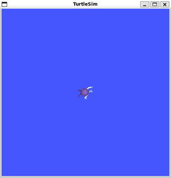

------------------------------------------------------------------------

### Использвание `turtlesim`
Открываем новый терминал и запускаем новый узел для контроля черепахи:
```bash
ros2 run turtlesim turtle_teleop_key
```
В этот момент у нас открыто 3 окна: 2 окна с запущенной оболочкой и одно – визуальное представление `turtlesim` с черепахой в центре.
Теперь можно управлять черепахой используя стрелки на клавиатуре. Черепаха будет перемещаться по экрану оставляя за собой след.

------------------------------------------------------------------------

### Установка `rqt`
На Linux, для установки `rqt` необходимо выполнить:
```bash
sudo apt update
sudo apt install '~nros-humble-rqt*'
```
Чтобы запустить rqt:
```bash
rqt
```

------------------------------------------------------------------------

### Использование `rqt`
При первом запуске rqt, окно будет пустым. Выберите `Plugins > Services > Service Caller` в меню rqt.


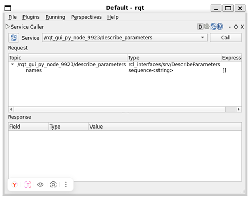


Чтобы убедиться, что все сервисы узла `turtlesim` доступны необходимо нажать на кнопку «обновление» (синяя кнопка с круглой стрелкой), расположенную слева от выпадающего меню. Далее необходимо нажать на выпадающее меню сервисов, чтобы увидеть все сервисы `turtlesim`. Затем нужно выбрать сервис `/spawn`.

------------------------------------------------------------------------

### Пробуем пользоваться сервисом `/spawn`
 С помощью rqt вызовите сервис `/spawn`. `/spawn` создаст еще одну черепаху в окне `turtlesim`. Давайте дадим новой черепашке имя, например: `turtle2`. Затем введем некоторые правильные координаты, например: `x = 1.0` и `y = 1.0`. 


 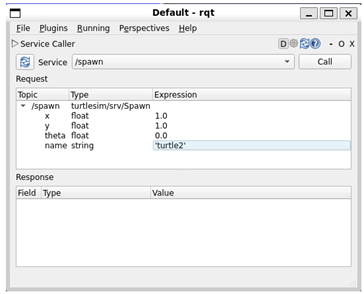

 
 Если вы попытаетесь создать новую черепаху с тем же именем, что и существующая, например, черепаха по умолчанию `turtle1`, вы получите сообщение об ошибке в терминале, в котором запущен `turtlesim_node`:
 ```
 [ERROR] [turtlesim]: A turtle named [turtle1] already exists
 ```
 Чтобы создать вторую черепаху необходимо вызвать сервис. Это можно сделать, нажав на кнопку `Call` в правом верхнем углу окна `rqt`. При успешном вызове сервиса в окне `turtlesim` появляется новая черепаха (немного не такая, как прежняя), в указанных нами координатах.
 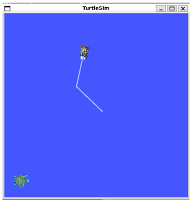
 Если снова обновить список сервисов в окне `rqt`, можно заметить новые сервисы, связанные с созданной черепахой, расположенные в подкатегории `/turtle2/…`, в дополнении к сервисам в категории `/turtle1/…`.

------------------------------------------------------------------------

 ### Пробуем пользоваться сервисом `/set_pen`
 Используя сервис `/set_pen` можно дать черепахе уникальную ручку (инструмент рисующих хвост за черепахой).
 В параметрах `/set_pen` можно указать значения `r`, `g`, `b` для цвета ручки (заметьте, что они имеют тип `uint8`, принимая при этом значения от 0 до 255), а также `width`, параметр, устанавливающий толщину линии (рисунок 5). Например, чтобы заставить черепаху «рисовать» при движении красной линией, можно установить следующие параметры:
`r = 255, g = 0, b = 0, width = 5`.
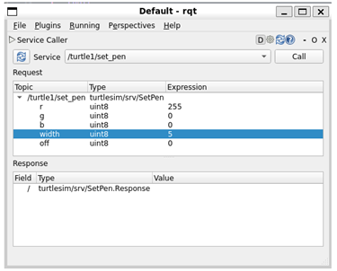
При этом нужно не забыть вызвать настроенный нами сервис. После этого можно вернуться в терминал с запущенным `turtle_teleop_key` и убедиться, что параметры успешно обновлены, а черепаха действительно оставляет красный след, пробуя управлять черепахой с клавиатуры.
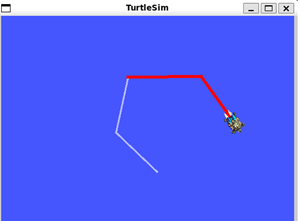
Возможно, вы также заметили, что пока никак нельзя управлять второй черепахой. Так происходит, потому что для неё пока не существует узла `teleop`.

------------------------------------------------------------------------

### Переназначение узла teleop
Для управления второй черепахой необходим новый узел `teleop`. Создав новый таФкой узел, пользуясь инструкцией выше, можно убедиться в том, что он также управляет первой черепахой. Для изменения его поведения необходимо переназначить топик `cmd_vel`. Для этого в новом терминале нужно запустить следующую строчку:
```bash
ros2 run turtlesim turtle_teleop_key --ros-args --remap turtle1/cmd_vel:=turtle2/cmd_vel
```
Теперь мы можем перемещать вторую черепаху, когда активно окно нового терминала, и старую — когда активно окно терминала с запущенным ранее узлом `turtle_teleop_key`.
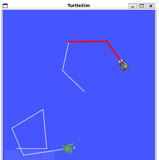

------------------------------------------------------------------------

### Закрываем `turtlesim`
Чтобы остановить симуляцию, можно нажать `ctrl + c` в терминале с `telesim` и `q` в терминалах с `turtle_teleop_key`.


------------------------------------------------------------------------

## 1.3 Понимание узлов
В данном подразделе говорится о функциях узлов в ROS2 и инструментах для взаимодействия с ними. Разберем несколько ключевых концепций ROS2, которые вместе образуют то, что называется графом ROS2. 
Граф ROS – это сеть из элементов, вместе и одновременно обрабатывающих данные. Если вы попытаетесь представить его визуально, то это будет нечто, охватывающее все исполняемые файлы и все связи между ними. Каждый узел в ROS2 должен быть ответственен за одну отдельную задачу, например, за управление двигателем в колесе или за отсылку данных, собранных с лазерного дальномера. Каждый узел может отправлять или получать данные при помощи топиков (`topics`), сервисов (`services`), действий (`actions`) или параметров (`parameters`).
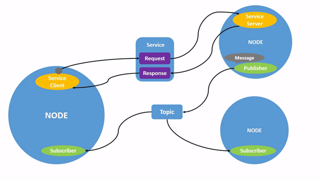
Полная робо-система состоит из многих узлов, работающих одновременно. В ROS 2 один исполняемый файл может содержать как один так и более одного узла.
1. **`ros2 run`**
   Команда `ros2 run` запускает исполняемый файл из пакета:
   ```
   ros2 run <package_name> <executable_name>
   ```
   Этой командой мы уже пользовались, когда запускали `turtlesim`.
   В команде:
   ```
   ros2 run turtlesim turtlesim_node
   ```
   `turtlesim` – имя пакета, а `turtlesim_node` – имя исполняемого файла.
   Однако мы все ещё не знаем названия узлов. Для этого используется команда `ros2 node list`.
2. **`ros2 node list`**
   Эта команда перечисляет имена всех запущенных узлов. Это может быть особенно полезно, когда необходимо взаимодействовать с тем или иным узлом, или же при работе с робо-системой, содержащей множество различных узлов, в которой постоянно необходимо следить за их изменениями.
    Попробуем ввести в терминал команду:
    ```
    ros2 node list
    ```
    Терминал вернет нам имя узла, в данном случае `/turtlesim`, поскольку мы запускали `turtlesim`:
    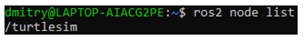
    Откроем новый терминал и запустим в нем исполняемый файл `turtle_teleop_key` из пакета `turtlesim`, а затем вернувший в терминал, где мы можем выполнять команды `ros2` снова выполним `ros2 bode list`.
    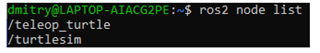
    Переназначение позволяет переопределить свойства узлов, заданные по умолчанию, например, имя узла, имена топиков и сервисов и т.д. Ранее мы переназначали топик `cmd_vel` для переключения управления на вторую черепаху.
    Теперь переопределим имя узла `/turtlesim`. 
3. **`ros2 node info`**
    Теперь, когда мы знаем названия узлов, можно также получить доступ к дополнительной информации о них с помощью команды:
    ```
    ros2 node info <node_name>
    ```
    Чтобы изучить узел `my_turtle`, выполним следующее:
    ```
    ros2 node info /my_turtle
    ```
    `ros2 node info` возвращает список всех «издателей» и «подписчиков» узла, а также список всех доступных сервисов и действий. Выведенная информация должна выглядеть так:
    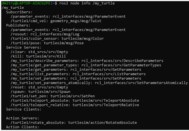

------------------------------------------------------------------------

## 1.4 Понимание топиков
ROS 2 разбивает сложные системы на множество модульных узлов. *Топики* – это важный элемент графа ROS, который служит шиной для обмена сообщениями между узлами. Узел может публиковать данные в любом количестве топиков и одновременно иметь подписки на любое количество топиков.
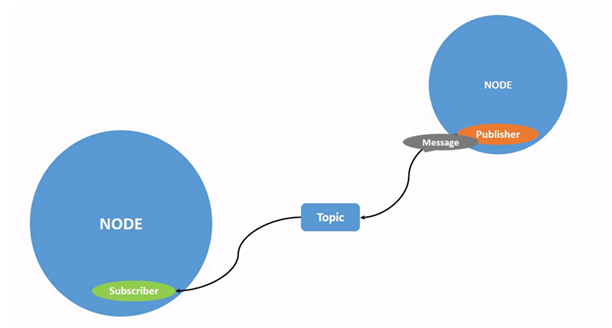
*Топики* — это один из основных способов перемещения данных между узлами и, соответственно, между различными частями системы.
Перейдем к настройке. К этому моменту вы уже должны быть в состоянии запустить `turtlesim`. Откройте новый терминал и выполните команду:
```
ros2 run turtlesim turtlesim_node
```
Откройте другой терминал и выполните команду:
```
ros2 run turtlesim turtle_teleop_key
```
Вспомните из предыдущего урока, что по умолчанию имена этих узлов - `/turtlesim` и `/teleop_turtle`.

------------------------------------------------------------------------

## 1.4.1 rqt_graph
Будем использовать `rqt_graph` для визуализации изменяющихся узлов и тем, а также связей между ними. 
Чтобы запустить `rqt_graph`, откройте новый терминал и введите команду:
```
rqt_graph
```
Вы также можете открыть `rqt_graph`, открыв `rqt` и выбрав `Plugins > Introspection > Node Graph`. 
Вы должны увидеть указанные выше узлы и топик, а также два действия по центре графа (пока не будем обращать на них внимания). Если наведете курсор на топик слева, то увидите выделение цветом, как на изображении выше. На графике показано, как узел `/turtlesim` и узел `/teleop_turtle` общаются друг с другом по топику. Узел `/teleop_turtle` публикует данные (нажатия клавиш, которые вы вводите для перемещения черепахи) в топик `/turtle1/cmd_vel`, а узел `/turtlesim` подписан на этот топик, чтобы получать данные.
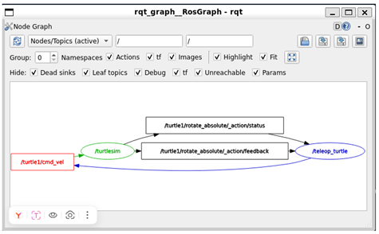
Функция выделения в `rqt_graph` очень полезна при изучении сложных систем с большим количеством узлов и топиков, связанных между собой различными способами.
`rqt_graph` - это графический инструмент интроспекции. Теперь мы рассмотрим некоторые инструменты командной строки для интроспекции топиков.

------------------------------------------------------------------------

## 1.4.2 ros2 topic list
Выполнив команду `ros2 topic list` в новом терминале, вы получите список всех топиков, активных в данный момент в системе.
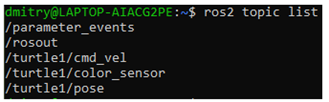
Команда `ros2 topic list -t` вернет тот же список топиков, на этот раз с указанием типа топика в скобках.
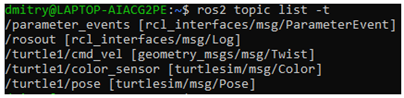
Благодаря этим атрибутам, в частности типу, узлы знают, что они говорят об одной и той же информации, когда она перемещается по топикам.
Если вам интересно, где находятся все эти топики в `rqt_graph`, вы можете снять все флажки в разделе `rqt «Hide»`.

------------------------------------------------------------------------

## 1.4.3 ros2 topic echo
Чтобы просмотреть данные, опубликованные по тому или иному топику, используйте:
```
ros2 topic echo <topic_name>
```
Поскольку мы знаем, что `/teleop_turtle` публикует данные в `/turtlesim` через топик `/turtle1/cmd_vel`, давайте воспользуемся `echo`, чтобы исследовать этот топик:
```
ros2 topic echo /turtle1/cmd_vel
```
Сначала эта команда не вернет никаких данных. Это потому, что она ждет, пока `/teleop_turtle` что-нибудь опубликует. Вернитесь в терминал, где запущена команда `turtle_teleop_key`, и используйте стрелки, чтобы перемещать черепашку. Следите за терминалом, где одновременно запущен ваш echo, и вы увидите, что данные о положении публикуются для каждого вашего движения. Теперь вернитесь в `rqt_graph` и снимите флажок `Debug`.
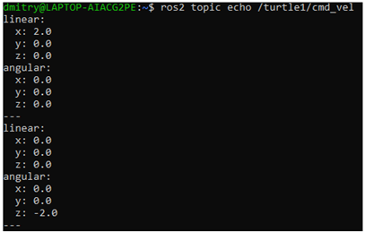
`/_ros2cli_1576` - это узел, созданный командой `echo`, которую мы только что выполнили (номер может быть другим). Теперь вы видите, что издатель публикует данные по топику `cmd_vel`, и на него подписаны два подписчика.

------------------------------------------------------------------------

## 1.4.4 ros2 topic info
Топики не обязательно должны быть связаны только с общением один на один; они могут быть один на один, много на один или много на много.
Другой способ взглянуть на это - выполнить следующую команду:
```
ros2 topic info /turtle1/cmd_vel
```

------------------------------------------------------------------------

## 1.4.5 ros2 interface show
Узлы отправляют данные по топикам с помощью сообщений. Издатели и подписчики должны отправлять и получать сообщения одного и того же типа, чтобы общаться.
Типы топиков, которые мы видели ранее после выполнения команды `ros2 topic list -t`, позволяют нам узнать, какой тип сообщения используется в каждом топике. Вспомним, что топик `cmd_vel` имеет тип:
```
geometry_msgs/msg/Twist
```
Это означает, что в пакете `geometry_msgs` есть `msg` под названием `Twist`.
Теперь мы можем выполнить команду `ros2 interface show <msg_type>` для этого типа, чтобы узнать его детали. В частности, какую структуру данных ожидает сообщение.
```
ros2 interface show geometry_msgs/msg/Twist
```
Для типа сообщения, приведенного выше, это дает результат как на рисунке:
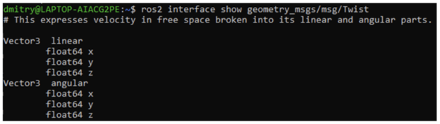
Это говорит о том, что узел `/turtlesim` ожидает сообщение с двумя векторами, линейным и угловым, по три элемента в каждом. Если вы вспомните данные, которые, как мы видели, `/teleop_turtle` передавал узлу `/turtlesim` с помощью команды `echo`, то они имеют ту же структуру.

------------------------------------------------------------------------

## 1.4.6 ros2 topic pub
Теперь, когда у вас есть структура сообщений, вы можете публиковать данные в топик прямо из командной строки:
```
ros2 topic pub <topic_name> <msg_type> '<args>'
```
*Аргумент `'<args>'`* – это фактические данные, которые вы передадите топику, в структуре, которую вы только что обнаружили в предыдущем разделе.
Для непрерывной работы черепашке (как и настоящим роботам, которых она призвана имитировать) требуется постоянный поток команд. Чтобы заставить черепаху двигаться и поддерживать ее в движении, вы можете использовать следующую команду. Важно отметить, что этот аргумент должен быть введен в синтаксисе YAML. 
Введите полную команду следующим образом:
```
ros2 topic pub /turtle1/cmd_vel geometry_msgs/msg/Twist "{linear: {x: 2.0, y: 0.0, z: 0.0}, angular: {x: 0.0, y: 0.0, z: 1.8}}"
```
Без параметров командной строки `ros2 topic pub` публикует команду непрерывным потоком с частотой 1 Гц.
Иногда вы можете захотеть опубликовать данные в топике только один раз (а не постоянно). Чтобы опубликовать команду только один раз, добавьте опцию `--once`.
```
ros2 topic pub --once -w 2 /turtle1/cmd_vel geometry_msgs/msg/Twist "{linear: {x: 2.0, y: 0.0, z: 0.0}, angular: {x: 0.0, y: 0.0, z: 1.8}}"
```
`--once` - необязательный аргумент, означающий «опубликовать одно сообщение и выйти».
`-w 2` - необязательный аргумент, означающий «ждать двух подходящих подписок». Это необходимо, поскольку на нас подписаны и черепаха `turtlesim`, и топик `echo`.
В терминале вы увидите следующий вывод:
```
Waiting for at least 2 matching subscription(s)...
publisher: beginning loop
publishing #1: geometry_msgs.msg.Twist(linear=geometry_msgs.msg.Vector3 (x=2.0, y=0.0, z=0.0), angular=geometry_msgs.msg.Vector3(x=0.0, y=0.0, z=1.8))
```
И вы увидите, как ваша черепашка будет двигаться так:
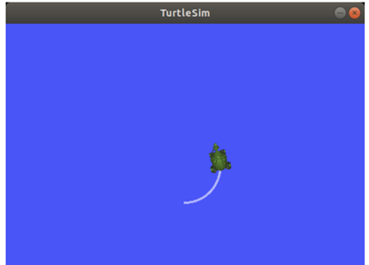
Вы можете обновить `rqt_graph`, чтобы увидеть происходящее в графическом виде. Вы увидите, что узел `ros2 topic pub ...` (`/_ros2cli_30358`) публикует топик `/turtle1/cmd_vel`, который сейчас получают и узел `ros2 topic echo ...` (`/_ros2cli_26646`), и узел `/turtlesim`.
Наконец, вы можете запустить `echo` на топике `pose` и перепроверить `rqt_graph`:
```
ros2 topic echo /turtle1/pose
```
Вы видите, что узел `/turtlesim` также публикует сообщения в топик `pose`, на который подписан новый узел `echo`. При публикации сообщений с временными метками у `pub` есть два метода для автоматического заполнения их текущим временем. Для сообщений с `std_msgs/msg/Header`, поле заголовка может быть установлено в `auto` для заполнения поля `stamp`.
```
ros2 topic pub /pose geometry_msgs/msg/PoseStamped '{header: "auto", pose: {position: {x: 1.0, y: 2.0, z: 3.0}}}'
```
Если сообщение не использует полный заголовок, а содержит только поле с типом `builtin_interfaces/msg/Time`, ему может быть присвоено значение `now`.
```
ros2 topic pub /reference sensor_msgs/msg/TimeReference '{header: "auto", time_ref: "now", source: "dumy"}'
```

------------------------------------------------------------------------

## 1.4.7 ros2 topic hz
Вы также можете просмотреть скорость публикации данных с помощью команды:
```
ros2 topic hz /turtle1/pose
```
Он возвращает данные о скорости, с которой узел `/turtlesim` публикует данные в топик `pose`.

------------------------------------------------------------------------

## 1.4.8 ros2 topic bw
Пропускную способность, используемую топиком, можно просмотреть с помощью команды:
```
ros2 topic bw /turtle1/pose
```
Он возвращает данные об использовании полосы пропускания и количестве сообщений, публикуемых в топике `/turtle1/pose`.

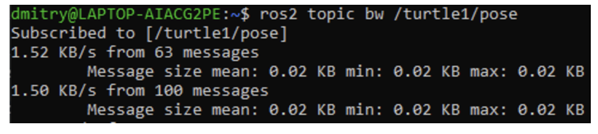

------------------------------------------------------------------------

## 1.4.9 ros2 topic find
Чтобы вывести список доступных топиков определенного типа, используйте:
```
ros2 topic find <topic_type>
```
Напомним, что топик `cmd_vel` имеет тип geometry_msgs/msg/Twist
Команда `find` выводит топики, доступные при задании типа сообщения:
```
ros2 topic find geometry_msgs/msg/Twist
```
Она выведет:
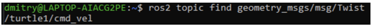

------------------------------------------------------------------------

## 1.5 Понимание сервисов
*Сервисы* – это еще один способ взаимодействия узлов в графе ROS. Сервисы основаны на модели «вызов-ответ», в отличие от модели «издатель-подписчик» в топиках. В то время как топики позволяют узлам подписываться на потоки данных и получать постоянные обновления, сервисы предоставляют данные только тогда, когда их специально вызывает клиент.
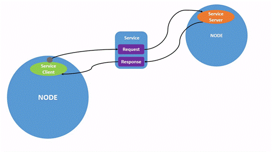
Для установки запустите два узла `turtlesim`, `/turtlesim` и /`teleop_turtle`. Откройте новый терминал и выполните команду:
```
ros2 run turtlesim turtlesim_node
ros2 run turtlesim turtle_teleop_key
```
Выполнив команду `ros2 service list` в новом терминале, вы получите список всех служб, активных в данный момент в системе.
Вы увидите, что на обоих узлах есть шесть одинаковых сервисов с `параметрами` в названиях. Почти каждый узел в ROS 2 имеет эти инфраструктурные сервисы, на основе которых строятся параметры. Подробнее о параметрах будет рассказано далее. В этом курсе сервисы параметров будут опущены из обсуждения.
Пока что давайте сосредоточимся на сервисах, специфичных для черепах: `/clear`, `/kill`, `/reset`, `/spawn`, `/turtle1/set_pen`, `/turtle1/teleport_absolute` и `/turtle1/teleport_relative`.
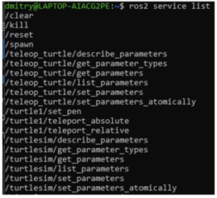

------------------------------------------------------------------------

## 1.5.1 Типы сервисов и команды для них
У сервисов есть типы, которые описывают, как структурированы данные запроса и ответа сервиса. Типы сервисов определяются аналогично типам топиков, за исключением того, что типы сервисов состоят из двух частей: одно сообщение для запроса, другое - для ответа. Чтобы узнать тип службы, используйте команду:
```
ros2 service type <service_name>
```
Давайте посмотрим на службу `/clear` в turtlesim. В новом терминале введите команду:
```
ros2 service type /clear
```
Которая должна вернуть следующее:
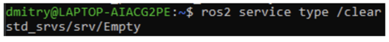
Тип `Empty` означает, что вызов сервиса не отправляет никаких данных при запросе и не получает никаких данных при получении ответа.
Чтобы увидеть типы всех активных служб одновременно, вы можете добавить опцию `--show-types`, сокращенно `-t`, к команде `list`:
```
ros2 service list -t
```
Данная команда вернет:
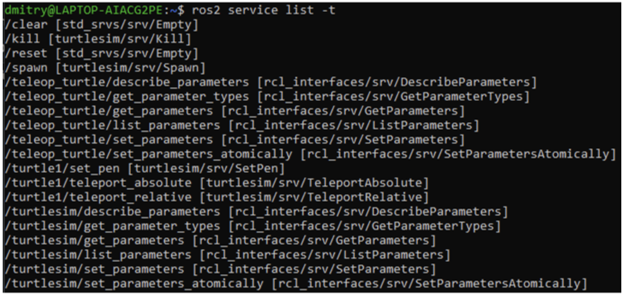
Если вы хотите найти все службы определенного типа, можно воспользоваться командой:
```
ros2 service find <type_name>
```
Например, вы можете найти все сервисы с типом `Empty` следующим образом:
```
ros2 service find std_srvs/srv/Empty
```
Вы можете вызывать службы из командной строки, но сначала вам нужно узнать структуру входных аргументов.
```
ros2 interface show <type_name>
```
Попробуйте сделать это на типе службы `/clear`, `Empty`:
```
ros2 interface show std_srvs/srv/Empty
```
Но, как вы узнали ранее, тип `Empty` не отправляет и не получает никаких данных. Поэтому, естественно, его структура пуста.
Давайте проанализируем сервис с типом, который отправляет и получает данные, например `/spawn`. Из результатов `ros2 service list -t` мы знаем, что тип `/spawn` - `turtlesim/srv/Spawn`. Чтобы увидеть аргументы запроса и ответа службы `/spawn`, выполните команду:
```
ros2 interface show turtlesim/srv/Spawn
```
Информация над строкой `---` говорит нам об аргументах, необходимых для вызова `/spawn`. `x`, `y` и `theta` определяют двумерную позу создаваемой черепахи, а `name` явно необязателен.
Информация под строкой – это не то, что вам нужно знать в данном случае, но она может помочь вам понять тип данных в ответе, который вы получите в результате вызова.
Теперь, когда вы знаете, что такое тип сервиса, как найти тип сервиса и как найти структуру аргументов этого типа, вы можете вызывать сервис с помощью:
```
ros2 service call <service_name> <service_type> <arguments>
```
Часть `<arguments>` является необязательной. Например, вы знаете, что у типизированных сервисов `Empty` нет аргументов:
```
ros2 service call /clear std_srvs/srv/Empty
```
Эта команда очистит окно turtlesim от всех линий, которые нарисовала ваша черепаха.
Теперь давайте породим новую черепаху, вызвав `/spawn` и задав аргументы. Ввод `<arguments>` при вызове сервиса из командной строки должен быть в синтаксисе YAML.
Введите команду:
```
ros2 service call /spawn turtlesim/srv/Spawn "{x: 2, y: 2, theta: 0.2, name: ''}"
```
Вы получите представление о происходящем в стиле метода, а затем ответ службы:
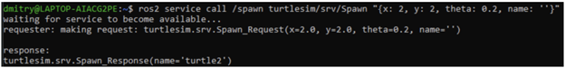
Ваше окно turtlesim сразу же обновится с новой черепахой:
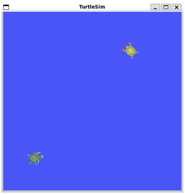

------------------------------------------------------------------------

## 1.6 Понимание параметров
В данном подразделе описывается, как получать, устанавливать, сохранять и перезагружать параметры в ROS2.
Параметр – это значение конфигурации узла. Параметры можно рассматривать как настройки узла. Узел может хранить параметры в виде целых чисел, плавающих чисел, булевых чисел, строк и списков. В ROS2 каждый узел хранит свои собственные параметры.
Для работы необходимо:
1. **Запустить два узла turtlesim, `/turtlesim` и `/teleop_turtle`.**
   Откройте новый терминал и выполните команду:
   ```
   ros2 run turtlesim turtlesim_node
   ```
   Откройте другой терминал и выполните команду:
   ```
   ros2 run turtlesim turtle_teleop_key
   ```
2. **`ros2 param list`**
    Чтобы увидеть параметры, принадлежащие вашим узлам, откройте новый терминал и введите команду:
    ```
    ros2 param list
    ```
    Вы увидите пространства имен узлов, `/teleop_turtle` и `/turtlesim`, а затем параметры каждого узла. У каждого узла есть параметр `use_sim_time`; он не является уникальным для turtlesim.
    Судя по их названиям, параметры `/turtlesim` определяют цвет фона окна turtlesim, используя значения цветов RGB.
3. **Чтобы определить тип параметра, вы можете использовать команду:**
    ```
    ros2 param get
    ```
    Чтобы отобразить тип и текущее значение параметра, используйте команду:
    ```
    ros2 param get <node_name> <parameter_name>
    ```
    Давайте узнаем текущее значение параметра `/turtlesim` `background_g`:
    ```
    ros2 param get /turtlesim background_g
    ```
    Теперь вы знаете, что `background_g` имеет целочисленное значение.
    Если вы выполните ту же команду для `background_r` и `background_b`, то получите значения `69` и `255`, соответственно.
4.	**`ros2 param set`**
    Чтобы изменить значение параметра во время выполнения, используйте команду:
    ```
    ros2 param set <node_name> <parameter_name> <value>
    ```
    Изменим цвет фона `/turtlesim`:
    ```
    ros2 param set /turtlesim background_r 200
    ```
    Ваш терминал должен выдать сообщение: `Set parameter successful`
    При этом фон вашего окна `turtlesim` должен изменить цвет.
5.	**`ros2 param dumb`**
    Вы можете просмотреть все текущие значения параметров узла с помощью команды:
    ```
    ros2 param dump <node_name>
    ```
    По умолчанию команда выводит данные на стандартный вывод (`stdout`), но вы также можете перенаправить значения параметров в файл, чтобы сохранить их на будущее. Чтобы сохранить текущую конфигурацию параметров `/turtlesim` в файл `turtlesim.yaml`, введите команду:
    ```
    ros2 param dump /turtlesim > turtlesim.yaml
    ```
    Вы найдете новый файл в текущем рабочем каталоге, в котором запущена ваша консоль. Если вы откроете этот файл, то увидите следующее содержимое:
    ```
    /turtlesim:
    ros__parameters:
        background_b: 255
        background_g: 86
        background_r: 200
        qos_overrides:
        /parameter_events:
            publisher:
            depth: 1000
            durability: volatile
            history: keep_last
            reliability: reliable
        use_sim_time: false
    ```
    Выгрузка параметров пригодится, если в будущем вы захотите перезагрузить узел с теми же параметрами.
6.	**`ros2 param load`**
    Вы можете загрузить параметры из файла в текущий работающий узел с помощью команды:
    ```
    ros2 param load <node_name> <parameter_file>
    ```
    Чтобы загрузить файл `turtlesim.yaml`, созданный с помощью `ros2 param dump`, в параметры узла `/turtlesim`, введите команду:
    ```
    ros2 param load /turtlesim turtlesim.yaml
    ```
    Ваш терминал выдаст сообщение:
    ```
    Set parameter background_b successful
    Set parameter background_g successful
    Set parameter background_r successful
    Set parameter qos_overrides./parameter_events.publisher.depth failed: parameter 'qos_overrides./parameter_events.publisher.depth' cannot be set because it is read-only
    Set parameter qos_overrides./parameter_events.publisher.durability failed: parameter 'qos_overrides./parameter_events.publisher.durability' cannot be set because it is read-only
    Set parameter qos_overrides./parameter_events.publisher.history failed: parameter 'qos_overrides./parameter_events.publisher.history' cannot be set because it is read-only
    Set parameter qos_overrides./parameter_events.publisher.reliability failed: parameter 'qos_overrides./parameter_events.publisher.reliability' cannot be set because it is read-only
    Set parameter use_sim_time successful
    ```
7.	**`Load parameter file on node startup`**
    Чтобы запустить тот же узел с сохраненными значениями параметров, используйте:
    ```
    ros2 run <package_name> <executable_name> --ros-args --params-file <file_name>
    ```
    Это та же команда, которую вы всегда используете для запуска turtlesim, с добавленными флагами `--ros-args` и `--params-file`, за которыми следует файл, который вы хотите загрузить.
    Остановите запущенный узел turtlesim и попробуйте перезагрузить его с сохраненными параметрами, используя:
    ```
    ros2 run turtlesim turtlesim_node --ros-args --params-file turtlesim.yaml
    ```
    Окно turtlesim должно появиться как обычно, но с фиолетовым фоном, который вы установили ранее.
    Узлы имеют параметры, определяющие их значения по умолчанию. Вы можете получать и устанавливать значения параметров из командной строки. Также можно сохранить настройки параметров в файл, чтобы перезагрузить их в будущем сеансе.
------------------------------------------------------------------------
## 1.7 Понимание действий
В данном подразделе разберем интроспективные действия в ROS2. Действия – это один из типов взаимодействия в ROS 2, который предназначен для выполнения длительных задач. Они состоят из 3 частей: цели, обратной связи и результата. Действия строятся на основе топиков и сервисов. Их функциональность аналогична сервисам, за исключением того, что действия можно отменить. Они также обеспечивают постоянную обратную связь, в отличие от сервисов, которые возвращают один ответ.
Действия используют модель клиент-сервер. Узел «клиент действия» отправляет цель узлу «сервер действия», который подтверждает цель и возвращает поток обратной связи и результат.
Для работы необходимо выполнить следующие шаги:
1.	**Установка**
    Запустите два узла turtlesim, `/turtlesim` и `/teleop_turtle`.
    Откройте новый терминал и выполните команду:
    ```
    ros2 run turtlesim turtlesim_node
    ```
    Откройте другой терминал и выполните команду:
    ```
    ros2 run turtlesim turtle_teleop_key
    ```
2. **Используйте действия**
    При запуске узла `/teleop_turtle` увидите в терминале следующее сообщение:
    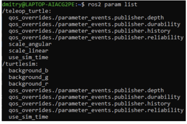
    Давайте сосредоточимся на второй строке, которая соответствует действию. Обратите внимание, что буквенные клавиши `G|B|V|C|D|E|R|T` образуют "коробку" вокруг клавиши `F` на американской QWERTY-клавиатуре. Положение каждой клавиши вокруг `F` соответствует ее ориентации в turtlesim.
    Обратите внимание на терминал, где запущен узел `/turtlesim`. Каждый раз, когда вы нажимаете одну из этих клавиш, вы отправляете цель на сервер действий, который является частью узла `/turtlesim`. Цель состоит в том, чтобы повернуть черепаху лицом в определенном направлении. Как только черепаха завершит вращение, на экране появится сообщение, сообщающее о результате выполнения цели:
    ```
    [INFO] [turtlesim]: Rotation goal completed successfully
    ```
    Клавиша `F` отменяет цель в середине ее выполнения. Попробуйте нажать клавишу `C`, а затем нажать клавишу `F`, прежде чем черепаха успеет завершить вращение. В терминале, где запущен узел `/turtlesim`, вы увидите сообщение:
    ```
    [INFO] [turtlesim]: Rotation goal canceled
    ```
    Остановить цель может не только сторона клиента (ввод в `teleop`), но и сторона сервера (узел `/turtlesim`). Когда сторона сервера решает остановить обработку цели, говорят, что цель "прервана".
    Попробуйте нажать клавишу `D`, а затем клавишу `G` до того, как завершится первое вращение. В терминале, где запущен узел `/turtlesim`, вы увидите сообщение:
    ```
    [WARN] [turtlesim]: Rotation goal received before a previous goal finished. Aborting previous goal
    ```
    Этот действующий сервер решил прервать выполнение первой цели, потому что получил новую. Он мог бы выбрать что-то другое, например отклонить новую цель или выполнить вторую цель после завершения первой. Не думайте, что каждый сервер действий решит прервать текущую цель, когда получит новую.
3.	**`ros2 node info`**
    Чтобы увидеть список действий, которые предоставляет узел, в данном случае `/turtlesim`, откройте новый терминал и выполните команду:
    ```
    ros2 node info /turtlesim
    ```
    Она вернет список подписчиков, издателей, сервисов, серверов действий и клиентов действий `/turtlesim`. 
    Обратите внимание, что действие `/turtle1/rotate_absolute` для `/turtlesim` находится в разделе `Action Servers`. Это означает, что `/turtlesim` реагирует на действие `/turtle1/rotate_absolute` и обеспечивает обратную связь.
    Узел `/teleop_turtle` имеет имя `/turtle1/rotate_absolute` в разделе `Action Clients`, что означает, что он посылает цели для этого имени действия. Чтобы увидеть это, выполните команду:
    ```
    ros2 node info /teleop_turtle
    ```
4.	**`ros2 action list`**
    Чтобы определить все действия в графе ROS, выполните команду:
    ```
    ros2 action list
    ```
    Это единственное действие в графике ROS на данный момент. Оно управляет вращением черепахи, как вы видели ранее. 
    Вы также уже знаете, что существует один клиент действия (часть `/teleop_turtle`) и один сервер действия (часть `/turtlesim`) для этого действия из команды `ros2 node info <node_name>`.
    У действий есть типы, как у тем и услуг. Чтобы найти тип действия `/turtle1/rotate_absolute`, выполните команду:
    ```
    ros2 action list -t
    ```
    В скобках справа от имени каждого действия (в данном случае только `/turtle1/rotate_absolute`) указан тип действия, `turtlesim/action/RotateAbsolute`.
5.	**`ros2 action info`**
    Вы можете дополнительно проанализировать действие `/turtle1/rotate_absolute` с помощью команды:
    ```
    ros2 action info /turtle1/rotate_absolute
    ```
    Это говорит нам о том, что мы узнали ранее, запустив `ros2 node info` на каждом узле: Узел `/teleop_turtle` имеет клиент действия, а узел `/turtlesim` имеет сервер действия для действия `/turtle1/rotate_absolute`.
6.	**`ros2 interface show`**
    Еще одна информация, которая вам понадобится перед отправкой или выполнением цели действия – это структура типа действия. Команда для этого:
    ```
    ros2 interface show turtlesim/action/RotateAbsolute
    ```
    Оно вернет примерно такой результат:
    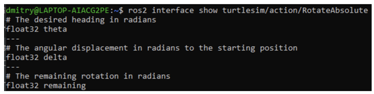
    Раздел этого сообщения над первым `---` - это структура (тип данных и имя) запроса цели. Следующий раздел - это структура результата. Последняя секция - структура обратной связи.
7.	**`ros2 action send_goal`**
    Теперь давайте отправим цель действия из командной строки со следующим синтаксисом:
    ```
    ros2 action send_goal <action_name> <action_type> <values>
    ```
    `<values>` должны быть в формате YAML.
    Следите за окном turtlesim и введите в терминале следующую команду:
    ```
    ros2 action send_goal /turtle1/rotate_absolute turtlesim/action/RotateAbsolute "{theta: 1.57}"
    ```
    Вы должны увидеть вращение черепахи, а также следующее сообщение в терминале.
    Все цели имеют уникальный идентификатор, который отображается в ответном сообщении. Вы также можете увидеть результат - поле с именем `delta`, которое представляет собой смещение к начальной позиции.
    Чтобы увидеть обратную связь по этой цели, добавьте `--feedback` к команде `ros2 action send_goal`:
    ```
    ros2 action send_goal /turtle1/rotate_absolute turtlesim/action/RotateAbsolute "{theta: -1.57}" --feedback
    ```
    После выполнения вы можете увидеть в терминале следующее сообщение:
    ```
    Sending goal:
        theta: -1.57
    Goal accepted with ID: 94822f76d49f496d8854d0dfe6de8c87
    Feedback:
        remaining: -3.122000217437744
    Feedback:
        remaining: -3.1059999465942383
    …
    Result:
        delta: 3.1040000915527344

    Goal finished with status: SUCCEEDED
    ```
    Действия похожи на сервисы, которые позволяют выполнять длительные задачи, обеспечивают регулярную обратную связь и могут быть отменены.
    Роботизированная система, скорее всего, будет использовать действия для навигации. Цель действия может предписывать роботу отправиться в определенное место. Пока робот добирается до места, он может отправлять обновления по пути (т. е. обратную связь), а затем сообщение о конечном результате, когда он достигнет места назначения.
    В Turtlesim есть сервер действий, на который клиенты действий могут отправлять цели для вращения черепашек. В этом уроке вы проанализировали действие `/turtle1/rotate_absolute`, чтобы лучше понять, что такое действия и как они работают.
------------------------------------------------------------------------
## 1.8 Использование rqt_console
`rqt_console` – это инструмент с графическим интерфейсом, используемый для просмотра сообщений журнала в ROS2. Обычно сообщения журнала отображаются в вашем терминале. С помощью `rqt_console` вы можете собирать эти сообщения в течение определенного времени, просматривать их внимательно и более организованно, фильтровать их, сохранять и даже перезагружать сохраненные файлы, чтобы проанализировать их в другое время.
Узлы используют журналы для вывода сообщений о событиях и состоянии различными способами. Как правило, их содержание носит информационный характер.
Для работы необходимо следующее:
1.	**Настройка**
    Запустите `rqt_console` в новом терминале с помощью следующей команды:
    ```
    ros2 run rqt_console rqt_console
    ```
    В первом разделе консоли отображаются сообщения журнала вашей системы.
    В центре у вас есть возможность отфильтровать сообщения по исключению уровней серьезности. Вы также можете добавить дополнительные фильтры исключений с помощью кнопки со знаком плюс справа.
    Нижний раздел предназначен для выделения сообщений, содержащих введенную вами строку. В этот раздел также можно добавить дополнительные фильтры.
    Теперь запустите `turtlesim` в новом терминале, выполнив следующую команду:
    ```
    ros2 run turtlesim turtlesim_node
    ```
2. **Сообщения в `rqt_console`**
    Чтобы вывести сообщения журнала на экран `rqt_console`, пусть черепаха врежется в стену. В новом терминале введите приведенную ниже команду `ros2 topic pub`:
    ```
    ros2 topic pub -r 1 /turtle1/cmd_vel geometry_msgs/msg/Twist "{linear: {x: 2.0, y: 0.0, z: 0.0}, angular: {x: 0.0,y: 0.0,z: 0.0}}"
    ```
    Поскольку приведенная выше команда публикует тему с постоянной скоростью, черепаха постоянно наталкивается на стену. В `rqt_console` вы увидите одно и то же сообщение с уровнем серьезности `Warn`, отображаемое снова и снова, как показано ниже:
    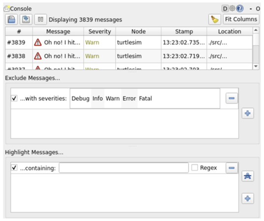
    Нажмите `Ctrl+C` в терминале, где вы выполняли команду `ros2 topic pub`, чтобы черепаха не врезалась в стену.
3. **Уровни логгирования**
    Уровни логов в ROS 2 упорядочены по степени серьезности:
    ```
    Fatal
    Error
    Warn
    Info
    Debug
    ```
    Точного стандарта, что обозначает каждый уровень, не существует, но можно с уверенностью предположить, что:
    - `Fatal` Сообщения указывают на то, что система собирается завершить работу, чтобы попытаться защитить себя от негативных последствий.
    - `Error` Сообщения указывают на серьезные проблемы, которые не обязательно приведут к повреждению системы, но мешают ее нормальному функционированию.
    - `Warn` Сообщения указывают на неожиданную активность или неидеальные результаты, которые могут представлять собой более глубокую проблему, но не наносят прямого вреда функциональности
    - `Info` Сообщения указывают на события и обновления состояния, которые служат визуальным подтверждением того, что система работает в соответствии с ожиданиями.
    - `Debug` сообщения подробно описывают весь пошаговый процесс выполнения системы.

    По умолчанию используется уровень `Info`. Вы будете видеть только сообщения стандартного уровня серьезности и более серьезных уровней. Обычно скрываются только сообщения `Debug`, потому что это единственный уровень, менее серьезный, чем `Info`. Например, если вы установите уровень по умолчанию `Warn`, вы будете видеть только сообщения со степенью серьезности `Warn`, `Error` и `Fatal`. Вы можете установить уровень регистратора по умолчанию при первом запуске узла `/turtlesim` с помощью ремаппинга.
    Введите в терминале следующую команду:
    ```
    ros2 run turtlesim turtlesim_node --ros-args --log-level WARN
    ```
    Теперь вы не увидите начальных сообщений уровня `Info`, которые появлялись в консоли при последнем запуске `turtlesim`. Это потому, что сообщения `Info` имеют более низкий приоритет, чем новая серьезность по умолчанию, `Warn`.
    Итак, `rqt_console` может быть очень полезен, если вам нужно внимательно изучить сообщения журнала вашей системы. Вы можете захотеть изучить сообщения журнала по разным причинам, обычно для того, чтобы выяснить, где что-то пошло не так и какие события привели к этому.
------------------------------------------------------------------------
## 1.9 Запуск узлов
В данном подразделе мы научимся использовать инструмент командной строки для одновременного запуска нескольких узлов.
В большинстве вводных уроков мы открывали новые терминалы для каждого нового запущенного узла. По мере создания более сложных систем с большим количеством одновременно работающих узлов открытие терминалов и повторный ввод конфигурационных данных становится утомительным.
Файлы запуска позволяют одновременно запускать и настраивать несколько исполняемых файлов, содержащих узлы ROS2.
Запуск одного файла запуска с помощью команды `ros2 launch` запустит всю вашу систему - все узлы и их конфигурации - одновременно.
1. **Запуск файла запуска**
    Откройте новый терминал и выполните команду:
    ```
    ros2 launch turtlesim multisim.launch.py
    ```
    Эта команда запустит следующий файл запуска:
    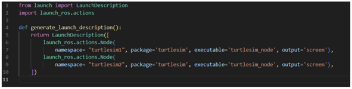
    Это позволит запустить два узла turtlesim:
    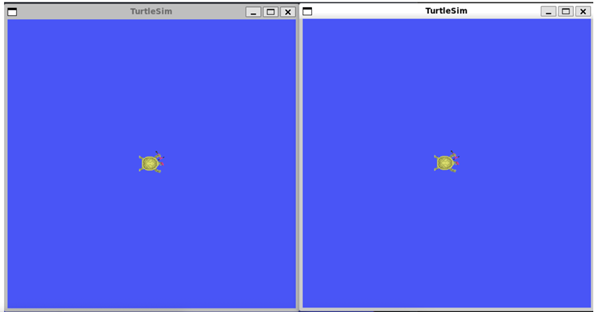
2.	**Управление узлами Turtlesim**
    Теперь, когда эти узлы запущены, вы можете управлять ими, как и любыми другими узлами ROS 2. Например, вы можете заставить черепашек двигаться в противоположных направлениях, открыв два дополнительных терминала и выполнив следующие команды:
    Во втором терминале:
    ```
    ros2 topic pub  /turtlesim1/turtle1/cmd_vel geometry_msgs/msg/Twist "{linear: {x: 2.0, y: 0.0, z: 0.0}, angular: {x: 0.0, y: 0.0, z: 1.8}}"
    ```
    В третьем терминале:
    ```
    ros2 topic pub  /turtlesim2/turtle1/cmd_vel geometry_msgs/msg/Twist "{linear: {x: 2.0, y: 0.0, z: 0.0}, angular: {x: 0.0, y: 0.0, z: -1.8}}"
    ```
    После выполнения этих команд вы должны увидеть что-то вроде черепах, которые рисуют круг.
    Когда вы научитесь писать собственные файлы запуска, вы сможете запускать несколько узлов - и настраивать их конфигурацию - аналогичным образом, с помощью команды `ros2 launch`.
------------------------------------------------------------------------
## 1.10 Запись и воспроизведение данных
После данного раздела вы должны научиться записывать данные, опубликованные по топику, чтобы в любой момент можно было воспроизвести и изучить их.
`ros2 bag` — это инструмент командной строки для записи данных, опубликованных в топиках в вашей системе. Он накапливает данные, переданные по любому количеству топиков, и сохраняет их в базе данных. Затем вы можете воспроизвести эти данные для воспроизведения результатов ваших тестов и экспериментов. Запись топиков — это также отличный способ поделиться своими наработками и дать возможность другим воссоздать их.
Вы будете записывать ввод с клавиатуры в системе `turtlesim`, чтобы сохранить и воспроизвести его позже, поэтому начните с запуска узлов `/turtlesim` и `/teleop_turtle`.
Откройте новый терминал и выполните команду:
```
ros2 run turtlesim turtlesim_node
```
Откройте другой терминал и выполните команду:
```
ros2 run turtlesim turtle_teleop_key
```
Давайте также создадим новую директорию для хранения сохраненных записей.
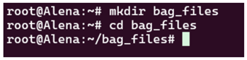
`ros2 bag` может записывать данные из опубликованных сообщений только в топики. Чтобы просмотреть список топиков вашей системы, откройте новый терминал и выполните команду:
```
ros2 topic list
```
Как мы узнали ранее, узел `/turtle_teleop` публикует команды в топике `/turtle1/cmd_vel`, чтобы заставить черепаху двигаться в turtlesim.
Чтобы увидеть данные, которые публикует тема `/turtle1/cmd_vel`, выполните команду:
```
ros2 topic echo /turtle1/cmd_vel
```
Сначала ничего не появится, потому что `teleop` не публикует никаких данных. Вернитесь на терминал, где вы запустили `teleop`, и выберите его, чтобы он стал активным. Используйте клавиши со стрелками, чтобы перемещать черепашку, и вы увидите, что данные публикуются на терминале, где запущена `ros2 topic echo`.
Чтобы записать данные, опубликованные в одном топике, используйте команду:
```
ros2 bag record <topic_name>
```
Перед выполнением этой команды на выбранном вами топике откройте новый терминал и перейдите в каталог `bag_files`, который вы создали ранее, потому что файл rosbag будет сохранен в том каталоге, в котором вы его запустили.
Выполните команду:
```
ros2 bag record /turtle1/cmd_vel
```
В терминале вы увидите следующие сообщения:
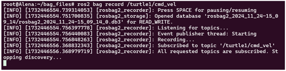
Теперь `ros2 bag` записывает данные, опубликованные в топике `/turtle1/cmd_vel`. Вернитесь к телеоп-терминалу и снова подвигайте черепаху. Движения не имеют значения, но постарайтесь создать узнаваемую картину, чтобы увидеть ее при последующем воспроизведении данных.
Нажмите `Ctrl+C`, чтобы остановить запись.
Данные будут накоплены в новом каталоге bag с именем по шаблону `rosbag2_год_месяц_день_час_минута_секунда`. Этот каталог будет содержать `metadata.yaml` вместе с файлом bag в записанном формате.
Вы можете записать несколько топиков, а также изменить имя файла, в который сохраняется `ros2 bag`.
Выполните следующую команду:
```
ros2 bag record -o subset /turtle1/cmd_vel /turtle1/pose
```
Опция `-o` позволяет выбрать уникальное имя для файла мешка. Следующая строка, в данном случае `subset`, является именем файла.
Чтобы записать несколько топиков одновременно, просто перечислите их через пробел.
Вы можете перемещать черепашку и нажать `Ctrl+C`, когда закончите.
Вы можете просмотреть подробную информацию о записи, выполнив команду:
```
ros2 bag info <bag_file_name>
```
Выполнив эту команду над файлом `subset`, вы получите список информации о файле:
```
ros2 bag info subset
```
Перед воспроизведением файла пакета введите `Ctrl+C` в терминале, где запущен teleop. Затем убедитесь, что окно turtlesim открыто, чтобы вы могли увидеть файл bag в действии.
Введите команду:
```
ros2 bag play subset
```
Терминал выдаст сообщение:
```
[INFO] [rosbag2_storage]: Opened database 'subset'.
```
Ваша черепашка будет следовать по тому же пути, который вы указали во время записи (хотя и не на 100% точно, т.к. turtlesim чувствителен к небольшим изменениям в синхронизации системы).
Поскольку в файле `subset` записан топик `/turtle1/pose`, команда `ros2 bag play` не прервется до тех пор, пока запущен turtlesim, даже если вы не двигаетесь.
Это происходит потому, что пока узел `/turtlesim` активен, он регулярно публикует данные в топике `/turtle1/pose`. Возможно, вы заметили в приведенном выше результате примера `ros2 bag info`, что в топике `Count` темы `/turtle1/cmd_vel` было только 9; именно столько раз мы нажимали на клавиши со стрелками во время записи.
Обратите внимание, что `/turtle1/pose` имеет значение `Count` более 3000; пока мы вели запись, данные по этому топику были опубликованы 3000 раз.
Чтобы получить представление о том, как часто публикуются данные о положении, можно выполнить команду:
```
ros2 topic hz /turtle1/pose
```
С помощью команды `ros2 bag` вы можете записывать данные, передаваемые по топикам в вашей системе ROS2. Если вы хотите поделиться своей работой с другими или проанализировать собственные эксперименты, это отличный инструмент, о котором стоит знать.

------------------------------------------------------------------------
## 2 Базовые клиентские библиотеки

В главе рассматривается разработка пакетов и узлов с использованием клиентских библиотек ROS 2: rclcpp (C++) и rclpy (Python). Материал ориентирован на практику: создание workspace, сборка colcon, пакетная структура, точки входа, зависимости и запуск примеров.

------------------------------------------------------------------------
## 2.1 Создание рабочего пространства
*Рабочее пространство* – это каталог, содержащий пакеты ROS2. Перед использованием ROS2 необходимо создать рабочее пространство установки в терминале, в котором вы планируете работать. Это сделает пакеты ROS2 доступными для использования в этом терминале.
В зависимости от того, как вы установили ROS2 (из исходников или двоичных файлов) и на какой платформе вы работаете, ваша точная команда исходников будет отличаться:
```bash
source /opt/ros/humble/setup.bash
```
Создавать новый каталог (директорию) лучше всего для каждого нового рабочего пространства. Название не имеет значения, но полезно, чтобы оно указывало на назначение рабочей области. Давайте выберем имя директории `ros2_ws`, для «рабочей области разработки»:
```bash
mkdir -p ~/ros2_ws/src
cd ~/ros2_ws/src
```
Еще одна лучшая практика - помещать все пакеты в рабочую область в каталог src. Приведенный выше код создает каталог `src` внутри `ros2_ws`, а затем переходит в него.
Перед клонированием примера репозитория убедитесь, что вы все еще находитесь в директории `ros2_ws/src`.
У репозитория может быть несколько веток. Вам нужно проверить ту, которая нацелена на ваш установленный дистрибутив ROS 2. Когда вы будете клонировать репозиторий добавьте аргумент `-b`, за которым следует эта ветка.
В каталоге `ros2_ws/src` выполните следующую команду:
```bash
git clone https://github.com/ros/ros_tutorials.git -b humble
```
Теперь `ros_tutorials` клонирован в ваше рабочее пространство. Репозиторий `ros_tutorials` содержит пакет `turtlesim`, который мы будем использовать в остальной части этого руководства. Другие пакеты в этом репозитории не собираются, потому что содержат файл `COLCON_IGNORE`.
Пока что вы заполнили свое рабочее пространство примером пакета, но это еще не полностью функциональное рабочее пространство. Вам нужно сначала устранить зависимости, а затем собрать рабочее пространство.
Перед сборкой рабочего пространства необходимо разрешить зависимости пакета. Возможно, у вас уже есть все зависимости, но лучше всего проверять их при каждом клонировании. Вы же не хотите, чтобы сборка завершилась неудачей после долгого ожидания и только потом выяснилось, что зависимостей не хватает.
Из корня рабочей области (`ros2_ws`) выполните следующую команду:
```bash
# выполните cd, если вы все еще находитесь в директории ``src`` с клоном ``ros_tutorials``
cd ..
rosdep install -i --from-path src --rosdistro humble -y
```
Если у вас уже есть все зависимости, консоль вернет:
```bash
#All required rosdeps installed successfully
```
Пакеты объявляют о своих зависимостях в файле package.xml. Эта команда просматривает эти объявления и устанавливает те, которые отсутствуют.
Теперь из корня рабочего пространства (`ros2_ws`) вы можете собрать пакеты с помощью команды:
```bash
colcon build
```
Консоль выдаст следующее сообщение:
```
Starting >>> turtlesim
Finished <<< turtlesim [5.49s]

Summary: 1 package finished [5.58s]
```
После завершения сборки введите команду в корне рабочей области (~/ros2_ws): ls. И вы увидите, что colcon создал новые каталоги:
```
build  install  log  src
```
В каталоге `install` находятся установочные файлы рабочей области, которые вы можете использовать для создания оверлея.
Перед созданием оверлея очень важно открыть новый терминал, отдельный от того, в котором вы собирали рабочее пространство. Исходное наложение в том же терминале, где вы создавали рабочее пространство, или в том же здании, где создается наложение, может создать сложные проблемы.
В новом терминале создайте основное окружение ROS 2 в качестве «подложки», чтобы можно было построить оверлей «поверх» него:
Перейдите в корень рабочей области:
```bash
cd ~/ros2_ws
```
В корневой части создайте источник оверлея:
```bash
source install/local_setup.bash
```
Теперь вы можете запустить пакет turtlesim из оверлея. Вы можете изменить `turtlesim` в вашем оверлее, отредактировав строку заголовка в окне turtlesim. Для этого найдите файл `turtle_frame.cpp` в каталоге `~/ros2_ws/src/ros_tutorials/turtlesim/src`. Откройте файл `turtle_frame.cpp` в удобном для вас текстовом редакторе.
Найдите функцию `setWindowTitle(«TurtleSim»);`, измените значение `«TurtleSim»` на `«MyTurtleSim»` и сохраните файл.
Вернитесь в первый терминал, где вы ранее запускали `colcon build`, и запустите ее снова.
Вернитесь во второй терминал (где находится оверлей) и снова запустите turtlesim:
Вы увидите, что в строке заголовка окна turtlesim теперь написано «MyTurtleSim».
Даже если ваша основная среда ROS 2 была создана в этом терминале ранее, оверлей среды `ros2_ws` имеет приоритет над содержимым подложки.
Чтобы убедиться, что ваша подложка не повреждена, откройте новый терминал и создайте только вашу установку ROS 2. Снова запустите turtlesim.

Видно, что изменения в оверлее фактически не повлияли ни на что в подложке.
Использование оверлеев рекомендуется при работе над небольшим количеством пакетов, чтобы не размещать все в одном рабочем пространстве и не перестраивать огромное рабочее пространство на каждой итерации.

------------------------------------------------------------------------

## 2.2 Использование colcon для сборки пакетов
*Сolcon* – это итерация инструментов сборки ROS `catkin_make`, `catkin_make_isolated`, `catkin_tools` и `ament_tools`.
Для установки colcon необходима команда:
```bash
sudo apt install python3-colcon-common-extensions
```

*Рабочее пространство ROS* – это каталог с определенной структурой. Обычно в ней есть подкаталог `src`. Внутри этого подкаталога находится исходный код пакетов ROS. Как правило, каталог начинается с пустого места. `colcon` выполняет сборку из исходных текстов. По умолчанию он создаст следующие каталоги в качестве аналогов каталога `rc`:
- в директории `build` будут храниться промежуточные файлы. Для каждого пакета будет создана подпапка, в которой, например, будет вызываться CMake;
- каталог `install` - это место, куда будет устанавливаться каждый пакет, по умолчанию каждый пакет будет установлен в отдельный подкаталог;
- каталог `log` содержит различную журнальную информацию о каждом вызове colcon.

Сначала создайте каталог (`ros2_ws`), в котором будет находиться наше рабочее пространство:
```bash
mkdir -p ~/ros2_ws/src
cd ~/ros2_ws
```
На данный момент рабочая область содержит единственный пустой каталог `src`:
```
└── src
1 directory, 0 files
```
Давайте клонируем репозиторий примеров в каталог `src` рабочего пространства:
```bash
git clone https://github.com/ros2/examples src/examples -b humble
```
Теперь в рабочей области должен быть исходный код примеров ROS 2:
```
└── src
    └── examples
        ├── CONTRIBUTING.md
        ├── LICENSE
        ├── rclcpp
        ├── rclpy
        └── README.md
4 directories, 3 files
```
В корне рабочей области запустите `colcon build`. Поскольку такие типы сборки, как `ament_cmake`, не поддерживают концепцию пространства `devel` и требуют установки пакета, colcon поддерживает опцию `--symlink-install`. Это позволяет изменять установленные файлы, изменяя файлы в пространстве `source (например, файлы Python или другие некомпилируемые ресурсы) для ускорения итерации.
```bash
colcon build --symlink-install
```
После завершения сборки мы должны увидеть директории `build`, `install` и `log`:
```
├── build
├── install
├── log
└── src
4 directories, 0 files
```
Чтобы запустить тесты для пакетов, которые мы только что собрали, выполните следующие действия:
```bash
colcon test
```
Когда colcon успешно завершит сборку, результат будет находиться в директории `install`. Прежде чем вы сможете использовать установленные исполняемые файлы или библиотеки, вам нужно будет добавить их в пути и библиотеки. colcon создаст bash/bat файлы в директории `install`, чтобы помочь настроить окружение. Эти файлы добавят все необходимые элементы в ваши пути и библиотеки, а также предоставят любые команды bash или shell, экспортируемые пакетами.
```bash
source install/setup.bash
```
С созданным окружением мы можем запускать исполняемые файлы, собранные colcon. Давайте запустим узел подписчика из примеров:
```bash
ros2 run examples_rclcpp_minimal_subscriber subscriber_member_function
```
В другом терминале запустим узел-издатель (не забудьте указать исходный текст сценария настройки):
```bash
ros2 run examples_rclcpp_minimal_publisher publisher_member_function
```
Вы должны увидеть сообщения от издателя и подписчика с увеличивающимися цифрами.
Команда `colcon_cd` позволяет быстро сменить текущий рабочий каталог оболочки на каталог пакета. Например, команда `colcon_cd some_ros_package` быстро приведет вас в каталог `~/ros2_ws/src/some_ros_package`.
```bash
echo "source /usr/share/colcon_cd/function/colcon_cd.sh" >> ~/.bashrc
echo "export _colcon_cd_root=/opt/ros/humble/" >> ~/.bashrc
```

### 2.3 Создание пакета
*Пакет* – это организационная единица для вашего кода ROS2. Если вы хотите, чтобы ваш код можно было установить или поделиться им с другими, то вам нужно организовать его в виде пакета. С помощью пакетов вы можете выпустить свою работу над ROS2 и позволить другим легко собирать и использовать ее.
Для создания пакетов в ROS2 используется система сборки ament, а в качестве инструмента сборки – colcon. Вы можете создать пакет, используя CMake или Python, которые официально поддерживаются, хотя существуют и другие типы сборки.
Что входит в состав пакета ROS 2? Пакеты ROS 2 Python и CMake имеют свой минимально необходимый состав:
- `CMakeLists.txt` файл, описывающий, как собрать код в пакете,
- `include/<package_name>` каталог, содержащий публичные заголовки для пакета,
- `package.xml` файл, содержащий метаинформацию о пакете,
- `src` каталог, содержащий исходный код пакета.

Простейший пакет может иметь файловую структуру, которая выглядит следующим образом:
```
my_package/
     CMakeLists.txt
     include/my_package/
     package.xml
     src/
```
Одно рабочее пространство может содержать столько пакетов, сколько вы хотите, каждый в своей папке. Также в одном рабочем пространстве могут находиться пакеты разных типов сборки (CMake, Python и т. д.). Нельзя иметь вложенные пакеты.
Лучше всего иметь папку src в рабочей области и создавать пакеты в ней. Это позволяет сохранить верхний уровень рабочего пространства «чистым».
Тривиальное рабочее пространство может выглядеть следующим образом:
```
workspace_folder/
    src/
      cpp_package_1/
          CMakeLists.txt
          include/cpp_package_1/
          package.xml
          src/

      py_package_1/
          package.xml
          resource/py_package_1
          setup.cfg
          setup.py
          py_package_1/
      ...
      cpp_package_n/
          CMakeLists.txt
          include/cpp_package_n/
          package.xml
          src/
```
Для работы с пакетами необходимо:
1. **Создание пакета**
    Мы будем использовать рабочую область, созданную в предыдущем уроке, `ros2_ws`, для создания нового пакета. Сначала давайте перейдем в папку src. Для этого введите команду:
    ```bash
    cd ~/ros2_ws/src
    ```
    Теперь создадим наш первый пакет. Синтаксис команды для создания нового пакета в ROS 2 следующий:
    ```bash
    ros2 pkg create --build-type ament_cmake --license Apache-2.0 <package_name>
    ```
    В этом уроке мы используем дополнительный аргумент `--node-name`, который создаст для нас простой исполняемый файл типа Hello World. Введите следующую команду:
    ```bash
    ros2 pkg create --build-type ament_cmake --license Apache-2.0 --node-name my_node my_package
    ```
    Теперь в каталоге `src` вашего рабочего пространства появится новая папка под названием `my_package`.
    После выполнения команды в терминале появится следующее сообщение:
    ```
    going to create a new package
    package name: my_package
    destination directory: /home/user/ros2_ws/src
    package format: 3
    version: 0.0.0
    description: TODO: Package description
    maintainer: ['<name> <email>']
    licenses: ['TODO: License declaration']
    build type: ament_cmake
    dependencies: []
    node_name: my_node
    creating folder ./my_package
    creating ./my_package/package.xml
    creating source and include folder
    creating folder ./my_package/src
    creating folder ./my_package/include/my_package
    creating ./my_package/CMakeLists.txt
    creating ./my_package/src/my_node.cpp
    ```
    Вы можете увидеть автоматически сгенерированные файлы для нового пакета.
2. **Сборка пакета**
    Размещение пакетов в рабочем пространстве особенно ценно тем, что вы можете собирать много пакетов одновременно, выполнив команду `colcon build` в корне рабочего пространства. В противном случае вам пришлось бы собирать каждый пакет по отдельности.
    Давайте вернемся в корень рабочей области. Для этого введите:
    ```bash
    cd ~/ros2_ws
    ```
    Теперь соберем наши пакеты следующей командой:
    ```bash
    colcon build
    ```
    После выполнения команды мы увидим, что собрался не только наш пакет, но и пакет `turtlesim` из `ros_tutorials`, который мы добавили ранее. Когда в рабочем пространстве много пакетов, такая полная сборка может занять много времени. Чтобы в следующий раз собрать только пакет `my_package`, нужно выполнить команду:
    ```
    colcon build --packages-select my_package
    ```
3. **Источник установочного файла**
    Чтобы использовать новый пакет и исполняемый файл, сначала откройте новый терминал и создайте исходный код вашей основной установки ROS 2.
    Затем, находясь в директории `ros2_ws`, выполните следующую команду, чтобы создать исходное рабочее пространство:
    ```bash
    source install/local_setup.bash
    ```
    После выполнения этой команды наше рабочее пространство добавлено в путь, и мы можем использовать созданный пакет.
4.	**Использование пакета**
    Чтобы запустить наш узел, который мы создали с помощью аргумента `--node-name`, следует выполнить команду:
    ```bash
    ros2 run my_package my_node
    ```
    В терминале появится сообщение:
    ```
    hello world my_package package
    ```
5.	**Изучение содержимого пакета**
    Давайте посмотрим, что находится в нашем новом пакете. Если мы заглянем в директорию `ros2_ws/src/my_package`, то увидим следующие файлы и папки:
    ```
    CMakeLists.txt  include  package.xml  src
    ```
    Возможно, вы заметили в ответном сообщении после создания пакета, что поля `description` и `license` содержат пометки `TODO`. Это потому, что описание пакета и декларация лицензии не устанавливаются автоматически, но необходимы, если вы хотите выпустить свой пакет. Поле `maintainer` также может потребоваться заполнить.
6.	**Настройка файла `package.xml`**
    Теперь давайте настроим метаданные нашего пакета. Откройте файл `package.xml` в текстовом редакторе. Вы увидите следующее содержимое:
    ```xml
    <?xml version="1.0"?>
    <?xml-model
    href="http://download.ros.org/schema/package_format3.xsd"
    schematypens="http://www.w3.org/2001/XMLSchema"?>
    <package format="3">
    <name>my_package</name>
    <version>0.0.0</version>
    <description>TODO: Package description</description>
    <maintainer email="user@todo.todo">user</maintainer>
    <license>TODO: License declaration</license>
    <buildtool_depend>ament_cmake</buildtool_depend>
    <test_depend>ament_lint_auto</test_depend>
    <test_depend>ament_lint_common</test_depend>
    <export>
    <build_type>ament_cmake</build_type>
    </export>
    </package>
    ```
    Введите своё имя и электронную почту в строку сопровождающего, если она не была заполнена автоматически. Затем отредактируйте строку описания, чтобы кратко описать пакет:
    ```xml
    <description>Beginner client libraries tutorials practice package</description>
    ```
    Затем обновим информацию о лицензии:
    ```xml
    <license>Apache License 2.0</license>
    ```
    Не забудьте сохранить, когда закончите редактирование. 
    Ниже тега лицензии вы увидите несколько имен тегов, заканчивающихся на _depend. Это место, где ваш package.xml будет перечислять свои зависимости от других пакетов, чтобы colcon мог их искать. my_package прост и не имеет никаких зависимостей, но вы увидите, как это место будет использовано в последующих уроках.
    Вы создали пакет, чтобы упорядочить свой код и сделать его удобным для использования другими. Ваш пакет был автоматически заполнен необходимыми файлами, а затем вы использовали colcon для его сборки, чтобы вы могли использовать его исполняемые файлы в своем локальном окружении.

------------------------------------------------------------------------

## 2.4 Написание простого издателя и подписчика (C++)

*Узлы* – это исполняемые процессы, которые взаимодействуют в графе ROS. В этом учебнике узлы будут передавать друг другу информацию в виде строковых сообщений по теме. В данном примере используется простая система «говорящего» и «слушающего»; один узел публикует данные, а другой подписывается на тему, чтобы получать эти данные.
Откройте новый терминал и создайте исходный код вашей установки ROS 2, чтобы команды `ros2` работали.
Перейдите в каталог `ros2_ws`, созданный ранее на курсе. Напомним, что пакеты должны создаваться в директории `src`, а не в корне рабочей области. Поэтому перейдите в каталог `ros2_ws/src` и выполните команду создания пакета:
```bash
ros2 pkg create --build-type ament_cmake --license Apache-2.0 cpp_pubsub
```
Ваш терминал выдаст сообщение, подтверждающее создание пакета `cpp_pubsub` и всех его необходимых файлов и папок.
Перейдите в каталог `ros2_ws/src/cpp_pubsub/src`. Напомним, что это каталог в любом пакете CMake, в котором находятся исходные файлы, содержащие исполняемые файлы.
Для создания узла издателя загрузите пример кода talker, введя следующую команду:
```bash
wget -O publisher_member_function.cpp https://raw.githubusercontent.com/ros2/examples/humble/rclcpp/topics/minimal_publisher/member_function.cpp
```
Теперь появится новый файл с именем `publisher_member_function.cpp`. Откройте этот файл с помощью удобного для вас текстового редактора.
В верхней части кода находятся стандартные заголовки C++, которые вы будете использовать. После стандартных заголовков C++ идет включение `rclcpp/rclcpp.hpp`, которое позволяет использовать наиболее распространенные части системы ROS 2. Последним идет `std_msgs/msg/string.hpp`, который включает в себя встроенный тип сообщений, который вы будете использовать для публикации данных. Эти строки представляют собой зависимости узла. Напомним, что зависимости должны быть добавлены в `package.xml` и `CMakeLists.txt`, что вы сделаете в следующем разделе.
Следующая строка создает класс узла `MinimalPublisher`, наследуя от `rclcpp::Node`. Каждый `this` в коде ссылается на узел.
Публичный конструктор называет узел `minimal_publisher` и инициализирует `count_` в 0. Внутри конструктора издатель инициализируется типом сообщения `String`, именем темы `topic` и необходимым размером очереди для ограничения сообщений в случае резервного копирования. Далее инициализируется `timer_`, что заставляет функцию `timer_callback` выполняться дважды в секунду.
Функция `timer_callback` - это место, где устанавливаются данные сообщений и происходит их фактическая публикация. Макрос `RCLCPP_INFO` обеспечивает вывод каждого опубликованного сообщения на консоль. Последними объявляются поля таймера, издателя и счетчика. За классом `MinimalPublisher` следует класс `main`, в котором, собственно, и выполняется узел. `rclcpp::init` инициализирует ROS 2, а `rclcpp::spin` начинает обрабатывать данные от узла, включая обратные вызовы от таймера.
Чтобы добавить зависимости, перейдите на один уровень назад в директорию `ros2_ws/src/cpp_pubsub`, где для вас были созданы файлы `CMakeLists.txt` и `package.xml`. Откройте файл `package.xml` в текстовом редакторе.
Как уже говорилось в предыдущем уроке, не забудьте заполнить теги `<description>`, `<maintainer>` и `<license>`.
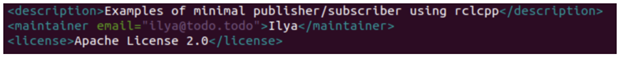
Добавьте новую строку после зависимости `ament_cmake` buildtool и вставьте следующие зависимости, соответствующие заявлениям include вашего узла:
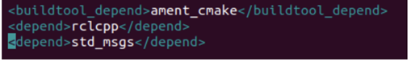
Это объявляет, что пакету нужны `rclcpp` и `std_msgs`, когда его код собирается и выполняется.
Обязательно сохраните файл. Теперь откройте файл `CMakeLists.txt`. Ниже существующей зависимости `find_package(ament_cmake REQUIRED)` добавьте строки:
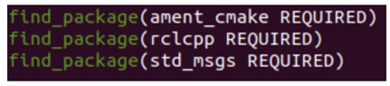
После этого добавьте исполняемый файл и назовите его `talker`, чтобы вы могли запустить узел с помощью `ros2 run`:
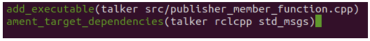
Наконец, добавьте секцию `install(TARGETS...)`, чтобы `ros2 run` мог найти ваш исполняемый файл:
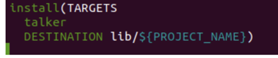
Вы можете очистить ваш `CMakeLists.txt`, удалив некоторые ненужные секции и комментарии, чтобы он выглядел следующим образом:
Вернитесь в `ros2_ws/src/cpp_pubsub/src` для создания следующего узла. Введите в терминал следующий код:
```bash
wget -O subscriber_member_function.cpp https://raw.githubusercontent.com/ros2/examples/humble/rclcpp/topics/minimal_subscriber/member_function.cpp
```
Убедитесь, что эти файлы существуют:
```bash
publisher_member_function.cpp  subscriber_member_function.cpp
```
Откройте файл `subscriber_member_function.cpp` в текстовом редакторе.
Код узла подписчика практически идентичен коду издателя. Теперь узел называется `minimal_subscriber`, а конструктор использует класс `create_subscription` узла для выполнения обратного вызова.
Таймера нет, потому что подписчик просто отвечает всякий раз, когда данные публикуются в теме `topic`.
Функция `topic_callback` получает данные строкового сообщения, опубликованного в теме, и просто записывает их в консоль с помощью макроса `RCLCPP_INFO`.
Единственным объявлением поля в этом классе является подписка.
Функция `main` точно такая же, только теперь она раскручивает узел `MinimalSubscriber`. Для узла-издателя раскрутка означает запуск таймера, а для подписчика - просто подготовку к приему сообщений, когда бы они ни пришли. Поскольку этот узел имеет те же зависимости, что и узел издателя, ничего нового в `package.xml` добавлять не нужно.
Откройте заново `CMakeLists.txt` и добавьте исполняемый файл и цель для узла subscriber ниже записей узла publisher. Не забудьте сохранить файл, и ваша система pub/sub будет готова.
Теперь переходим к сборке и запуску. Скорее всего, у вас уже установлены пакеты `rclcpp` и `std_msgs` как часть вашей системы ROS 2. Хорошей практикой является запуск `rosdep` в корне вашего рабочего пространства (`ros2_ws`), чтобы проверить наличие отсутствующих зависимостей перед сборкой:
```bash
rosdep install -i --from-path src --rosdistro humble -y
```
Все еще находясь в корне рабочей области, `ros2_ws`, соберите новый пакет:
```bash
colcon build --packages-select cpp_pubsub
```
Откройте новый терминал, перейдите в раздел `ros2_ws` и найдите установочные файлы:
```bash
. install/setup.bash
```
Теперь запустите узел `talker`:
```bash
ros2 run cpp_pubsub talker
```
Терминал должен начать публиковать информационные сообщения каждые 0,5 секунды, как показано ниже:
Откройте другой терминал, снова создайте файлы настроек внутри `ros2_ws`, а затем запустите узел прослушивателя:
```bash
ros2 run cpp_pubsub listener
```
Слушатель начнет печатать сообщения в консоль, начиная с того количества сообщений, на котором в данный момент находится издатель, как показано ниже:
Введите `Ctrl+C` в каждом терминале, чтобы остановить вращение узлов. Вы создали два узла для публикации и подписки на данные по теме. Перед их компиляцией и запуском вы добавили их зависимости и исполняемые файлы в файлы конфигурации пакета.

------------------------------------------------------------------------

## 2.5 Написание простого издателя и подписчика (Python)

В этом подразделе вы научитесь создавать узлы, которые будут передавать друг другу информацию в виде строковых сообщений через тему. В данном примере используется простая система «говорящего» и «слушающего»; один узел публикует данные, а другой подписывается на тему, чтобы получать эти данные.
Напомним, что пакеты должны создаваться в каталоге src, а не в корне рабочей области. Поэтому перейдите в каталог `ros2_ws/src` и выполните команду создания пакета:
```bash
ros2 pkg create --build-type ament_python --license Apache-2.0 py_pubsub
```
Ваш терминал выдаст сообщение, подтверждающее создание вашего пакета `py_pubsub` и всех необходимых файлов и папок.
Перейдите в директорию `ros2_ws/src/py_pubsub/py_pubsub`. Напомним, что эта директория представляет собой пакет Python с тем же именем, что и пакет ROS2, в который он вложен.
```bash
wget https://raw.githubusercontent.com/ros2/examples/humble/rclpy/topics/minimal_publisher/examples_rclpy_minimal_publisher/publisher_member_function.py
```
Теперь рядом с файлом `__init__.py` будет находиться новый файл с именем `publisher_member_function.py`. Откройте этот файл с помощью удобного для вас текстового редактора.
Перейдем к изучению кода. Первые строки кода после комментариев импортируют `rclpy`, чтобы можно было использовать его класс `Node`.
```py
import rclpy
from rclpy.node import Node
```
Следующий оператор импортирует встроенный тип сообщения string, который узел использует для структурирования данных, передаваемых в тему.
```py
from std_msgs.msg import String
```
Эти строки представляют собой зависимости узла. Напомним, что зависимости должны быть добавлены в `package.xml`, что вы и сделаете в следующем разделе. Далее создается класс `MinimalPublisher`, который наследует от (или является подклассом) `Node`.
```py
class MinimalPublisher(Node):
```
Ниже приведено определение конструктора класса. `super().__init__` вызывает конструктор класса `Node` и дает ему имя вашего узла, в данном случае `minimal_publisher`, `create_publisher` объявляет, что узел публикует сообщения типа `String` (импортированные из модуля `std_msgs.msg`), по теме с именем `topic`, и что «размер очереди» равен 10. Размер очереди - это необходимый параметр QoS (качество обслуживания), который ограничивает количество сообщений в очереди, если абонент не получает их достаточно быстро.
Далее создается таймер с обратным вызовом, который должен выполняться каждые 0,5 секунды. `self.i` - это счетчик, используемый в обратном вызове.
```py
def __init__(self):
    super().__init__('minimal_publisher')
    self.publisher_ = self.create_publisher(String, 'topic', 10)
    timer_period = 0.5  # seconds
    self.timer = self.create_timer(timer_period, self.timer_callback)
    self.i = 0
```
`timer_callback` создает сообщение с добавлением значения счетчика и публикует его в консоли с помощью `get_logger().info`.
```py
def timer_callback(self):
    msg = String()
    msg.data = 'Hello World: %d' % self.i
    self.publisher_.publish(msg)
    self.get_logger().info('Publishing: "%s"' % msg.data)
    self.i += 1
```
Наконец, определена главная функция.
```py
def main(args=None):
    rclpy.init(args=args)
    minimal_publisher = MinimalPublisher()
    rclpy.spin(minimal_publisher)

    # Destroy the node explicitly
    # (optional - otherwise it will be done automatically
    # when the garbage collector destroys the node object)
    minimal_publisher.destroy_node()
    rclpy.shutdown()
```
Сначала инициализируется библиотека `rclpy`, затем создается узел, а потом он «вращает» узел, чтобы вызывались его обратные вызовы. Перейдите на один уровень назад в каталог `ros2_ws/src/py_pubsub`, где для вас были созданы файлы `setup.py`, `setup.cfg` и `package.xml`.
```xml
<description>Examples of minimal publisher/subscriber using rclpy</description>
<maintainer email="you@email.com">Your Name</maintainer>
<license>Apache License 2.0</license>
```
После строк, указанных выше, добавьте следующие зависимости, соответствующие заявлениям об импорте вашего узла:
```xml
<exec_depend>rclpy</exec_depend>
<exec_depend>std_msgs</exec_depend>
```
Это объявляет, что пакету нужны `rclpy` и `std_msgs` при выполнении его кода.
Не забудьте сохранить файл.
Теперь добавим точки входа. Откройте файл `setup.py`. Снова сопоставьте поля `maintainer`, `maintainer_email`, `description` и `license` с вашим `package.xml`:
```py
maintainer='YourName',
maintainer_email='you@email.com',
description='Examples of minimal publisher/subscriber using rclpy',
license='Apache License 2.0',
```
Добавьте следующую строку в скобках `console_scripts` в поле `entry_points`:
```py
entry_points={
        'console_scripts': [
                'talker = py_pubsub.publisher_member_function:main',
        ],
},
```
Содержимое файла `setup.cfg` должно быть корректно заполнено автоматически, как показано ниже:
```
[develop]
script_dir=$base/lib/py_pubsub
[install]
install_scripts=$base/lib/py_pubsub
```
Это просто указывает setuptools поместить ваши исполняемые файлы в lib, потому что ros2 run будет искать их там
Вернитесь в `ros2_ws/src/py_pubsub/py_pubsub` для создания следующего узла. Введите в терминал следующий код:
```bash
wget https://raw.githubusercontent.com/ros2/examples/humble/rclpy/topics/minimal_subscriber/examples_rclpy_minimal_subscriber/subscriber_member_function.py
```
Теперь в каталоге должны быть эти файлы:
```bash
init__.py  publisher_member_function.py  subscriber_member_function.py
```
Откройте файл `subscriber_member_function.py` в текстовом редакторе.
Код узла подписчика практически идентичен коду издателя. Конструктор создает подписчика с теми же аргументами, что и издателя. Вспомните из учебника по темам, что имя темы и тип сообщения, используемые издателем и подписчиком, должны совпадать, чтобы они могли взаимодействовать.
```py
self.subscription = self.create_subscription(
    String,
    'topic',
    self.listener_callback,
    10)
```
Конструктор и обратный вызов подписчика не содержат определения таймера, потому что он ему не нужен. Его обратный вызов вызывается, как только он получает сообщение.
Определение обратного вызова просто печатает информационное сообщение в консоль вместе с полученными данными. Вспомните, что издатель определяет `msg.data = 'Hello World: %d' % self.i`.
```py
def listener_callback(self, msg):
    self.get_logger().info('I heard: "%s"' % msg.data)
```
Определение `main` почти полностью аналогично, заменяя создание и вращение издателя на подписчика.
```py
minimal_subscriber = MinimalSubscriber()
rclpy.spin(minimal_subscriber)
```
Поскольку этот узел имеет те же зависимости, что и издатель, в `package.xml` ничего нового добавлять не нужно. Файл `setup.cfg` также может оставаться нетронутым.
Далее необходимо добавление точки входа.
Откройте заново файл `setup.py` и добавьте точку входа для узла подписчика ниже точки входа издателя. Поле `entry_points` теперь должно выглядеть следующим образом:
```py
entry_points={
        'console_scripts': [
                'talker = py_pubsub.publisher_member_function:main',
                'listener = py_pubsub.subscriber_member_function:main',
        ],
},
```
Скорее всего, у вас уже установлены пакеты `rclpy` и `std_msgs` как часть вашей системы ROS 2. Хорошей практикой является запуск `rosdep` в корне вашего рабочего пространства (`ros2_ws`), чтобы проверить наличие отсутствующих зависимостей перед сборкой:
```bash
colcon build --packages-select py_pubsub
ros2 run py_pubsub talker
ros2 run py_pubsub listener
```
Вы создали два узла для публикации и подписки на данные по теме. Перед их запуском вы добавили их зависимости и точки входа в файлы конфигурации пакетов.

------------------------------------------------------------------------

## 2.6 Написание простого сервиса и клиента (C++)

Когда узлы общаются с помощью сервисов, узел, посылающий запрос на получение данных, называется клиентским узлом, а узел, отвечающий на запрос, - сервисным узлом. Структура запроса и ответа определяется файлом .srv.
В качестве примера здесь используется простая система сложения целых чисел; один узел запрашивает сумму двух целых чисел, а другой отвечает результатом.
Напомним, что пакеты должны создаваться в директории `src`, а не в корне рабочей области. Перейдите в каталог `ros2_ws/src` и создайте новый пакет:
```bash
ros2 pkg create --build-type ament_cmake --license Apache-2.0 cpp_srvcli --dependencies rclcpp example_interfaces
```
Ваш терминал выдаст сообщение, подтверждающее создание вашего пакета `cpp_srvcli` и всех необходимых файлов и папок.
Аргумент `--dependencies` автоматически добавит необходимые строки зависимостей в `package.xml` и `CMakeLists.txt`. `example_interfaces` - это пакет, включающий .srv-файл, необходимый для структурирования запросов и ответов:
```
int64 a
int64 b
---
int64 sum
```
Первые две строки – это параметры запроса, а ниже через тире - ответ.

------------------------------------------------------------------------

## 2.6.1 Обновление `package.xml`

Поскольку при создании пакета вы использовали опцию `--dependencies`, вам не нужно вручную добавлять зависимости в `package.xml` или `CMakeLists.txt`. Однако, как всегда, не забудьте добавить в `package.xml` описание, email и имя сопровождающего, а также информацию о лицензии.

```xml
<description>C++ client server tutorial</description>
<maintainer email="you@email.com">Your Name</maintainer>
<license>Apache License 2.0</license>
```

------------------------------------------------------------------------

## 2.6.2 Написание узла службы

Внутри директории `ros2_ws/src/cpp_srvcli/src` создайте новый файл `add_two_ints_server.cpp` и вставьте в него следующий код:

```cpp
#include "rclcpp/rclcpp.hpp"
#include "example_interfaces/srv/add_two_ints.hpp"

#include <memory>

void add(const std::shared_ptr<example_interfaces::srv::AddTwoInts::Request> request,
          std::shared_ptr<example_interfaces::srv::AddTwoInts::Response>      response)
{
  response->sum = request->a + request->b;
  RCLCPP_INFO(rclcpp::get_logger("rclcpp"), "Incoming request\na: %ld" " b: %ld",
                request->a, request->b);
  RCLCPP_INFO(rclcpp::get_logger("rclcpp"), "sending back response: [%ld]", (long int)response->sum);
}

int main(int argc, char **argv)
{
  rclcpp::init(argc, argv);

  std::shared_ptr<rclcpp::Node> node = rclcpp::Node::make_shared("add_two_ints_server");
rclcpp::Service<example_interfaces::srv::AddTwoInts>::SharedPtr service =
    node->create_service<example_interfaces::srv::AddTwoInts>("add_two_ints", &add);

  RCLCPP_INFO(rclcpp::get_logger("rclcpp"), "Ready to add two ints.");

  rclcpp::spin(node);
  rclcpp::shutdown();
}
```
Первые два утверждения `#include` - это зависимости вашего пакета.
Функция `add` складывает два целых числа из запроса и отдает сумму в ответ, одновременно уведомляя консоль о своем статусе с помощью логов.
```cpp
void add(const std::shared_ptr<example_interfaces::srv::AddTwoInts::Request> request, std::shared_ptr<example_interfaces::srv::AddTwoInts::Response>      response)
{
    response->sum = request->a + request->b;
    RCLCPP_INFO(rclcpp::get_logger("rclcpp"), "Incoming request\na: %ld" " b: %ld",
        request->a, request->b);
    RCLCPP_INFO(rclcpp::get_logger("rclcpp"), "sending back response: [%ld]", (long int)response->sum);
}
```
Функция `main` построчно выполняет следующие действия:
- Инициализирует клиентскую библиотеку ROS 2 C++:
    ```cpp
    rclcpp::init(argc, argv);
    ```
- Создает узел с именем `add_two_ints_server`:
    ```cpp
    std::shared_ptr<rclcpp::Node> node = rclcpp::Node::make_shared("add_two_ints_server");
    ```
- Создает сервис с именем `add_two_ints` для этого узла и автоматически рекламирует его в сетях с помощью метода `&add`:
    ```cpp
    rclcpp::Service<example_interfaces::srv::AddTwoInts>::SharedPtr service =
    node->create_service<example_interfaces::srv::AddTwoInts>("add_two_ints", &add);
    ```
- Печатает сообщение в журнале, когда все готово:
    ```cpp
    RCLCPP_INFO(rclcpp::get_logger("rclcpp"), "Ready to add two ints.");
    ```
- Раскручивает узел, делая службу доступной.
    ```cpp
    rclcpp::spin(node);
    ```

------------------------------------------------------------------------

## 2.6.3 Добавление исполняемого файла

Макрос `add_executable` генерирует исполняемый файл, который можно запустить с помощью `ros2 run`. Добавьте следующий блок кода в `CMakeLists.txt` для создания исполняемого файла с именем `server`:

```
add_executable(server src/add_two_ints_server.cpp)
ament_target_dependencies(server rclcpp example_interfaces)
```
Чтобы `ros2 run` мог найти исполняемый файл, добавьте следующие строки в конец файла, прямо перед `ament_package()`:
```
install(TARGETS
    server
  DESTINATION lib/${PROJECT_NAME})
```

------------------------------------------------------------------------

## 2.6.4 Создание клиентского узла

Внутри директории `ros2_ws/src/cpp_srvcli/src` создайте новый файл `add_two_ints_client.cpp` и вставьте в него следующий код:
```cpp
#include "rclcpp/rclcpp.hpp"
#include "example_interfaces/srv/add_two_ints.hpp"
#include <chrono>
#include <cstdlib>
#include <memory>

using namespace std::chrono_literals;

int main(int argc, char **argv)
{
  rclcpp::init(argc, argv);

  if (argc != 3) {
      RCLCPP_INFO(rclcpp::get_logger("rclcpp"), "usage: add_two_ints_client X Y");
      return 1;
  }

  std::shared_ptr<rclcpp::Node> node = rclcpp::Node::make_shared("add_two_ints_client");
rclcpp::Client<example_interfaces::srv::AddTwoInts>::SharedPtr client =
    node->create_client<example_interfaces::srv::AddTwoInts>("add_two_ints");

  auto request = std::make_shared<example_interfaces::srv::AddTwoInts::Request>();
  request->a = atoll(argv[1]);
  request->b = atoll(argv[2]);

  while (!client->wait_for_service(1s)) {
    if (!rclcpp::ok()) {
      RCLCPP_ERROR(rclcpp::get_logger("rclcpp"), "Interrupted while waiting for the service. Exiting.");
      return 0;
    }
    RCLCPP_INFO(rclcpp::get_logger("rclcpp"), "service not available, waiting again...");
  }

  auto result = client->async_send_request(request);
  // Wait for the result.
  if (rclcpp::spin_until_future_complete(node, result) ==
    rclcpp::FutureReturnCode::SUCCESS)
  {
    RCLCPP_INFO(rclcpp::get_logger("rclcpp"), "Sum: %ld", result.get()->sum);
  } else {
    RCLCPP_ERROR(rclcpp::get_logger("rclcpp"), "Failed to call service add_two_ints");
  }

  rclcpp::shutdown();
  return 0;
}
```
Как и в случае с узлом службы, следующие строки кода создают узел, а затем создают клиента для этого узла:
```cpp
std::shared_ptr<rclcpp::Node> node = rclcpp::Node::make_shared("add_two_ints_client");
rclcpp::Client<example_interfaces::srv::AddTwoInts>::SharedPtr client =
  node->create_client<example_interfaces::srv::AddTwoInts>("add_two_ints");
```
Далее создается запрос. Его структура определяется файлом .srv, о котором говорилось ранее.
```cpp
auto request = std::make_shared<example_interfaces::srv::AddTwoInts::Request>();
request->a = atoll(argv[1]);
request->b = atoll(argv[2]);
```
Цикл `while` дает клиенту 1 секунду на поиск сервисных узлов в сети. Если он не найдет ни одного, то продолжит ожидание.
```cpp
RCLCPP_INFO(rclcpp::get_logger("rclcpp"), "service not available, waiting again...");
```
Если клиент будет прерван (например, вы введете `Ctrl+C` в терминале), он вернет сообщение об ошибке, в котором будет указано, что он был прерван.
```cpp
RCLCPP_ERROR(rclcpp::get_logger("rclcpp"), "Interrupted while waiting for the service. Exiting.");
```
Затем клиент отправляет свой запрос, и узел вращается до тех пор, пока не получит ответ или не выйдет из строя.

------------------------------------------------------------------------

## 2.6.5 Добавление исполняемого файла

Вернитесь в `CMakeLists.txt`, чтобы добавить исполняемый файл и цель для нового узла. После удаления ненужных шаблонов из автоматически сгенерированного файла, ваш `CMakeLists.txt` должен выглядеть следующим образом:

```php
cmake_minimum_required(VERSION 3.5)
project(cpp_srvcli)

find_package(ament_cmake REQUIRED)
find_package(rclcpp REQUIRED)
find_package(example_interfaces REQUIRED)

add_executable(server src/add_two_ints_server.cpp)
ament_target_dependencies(server rclcpp example_interfaces)

add_executable(client src/add_two_ints_client.cpp)
ament_target_dependencies(client rclcpp example_interfaces)

install(TARGETS
  server
  client
  DESTINATION lib/${PROJECT_NAME})

ament_package()
```
Хорошей практикой является запуск `rosdep` в корне вашего рабочего пространства (`ros2_ws`), чтобы проверить наличие отсутствующих зависимостей перед сборкой:
Перейдите в корень рабочей области, ros2_ws, и соберите новый пакет:
```bash
colcon build --packages-select cpp_srvcli
```
Теперь запустите узел службы:
```
ros2 run cpp_srvcli server
```
Терминал должен выдать следующее сообщение, а затем подождать:
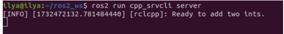
Откройте другой терминал, снова создайте файлы настроек внутри `ros2_ws`. Запустите клиентскую ноду, а затем любые два целых числа, разделенные пробелом:
```bash
ros2 run cpp_srvcli client 2 3
```
Если вы выбрали, например, `2` и `3`, клиент получит такой ответ:
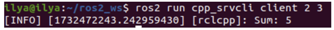
Вернитесь в терминал, где запущен ваш узел службы. Вы увидите, что он опубликовал сообщения журнала о получении запроса, полученных данных и ответа, который он отправил обратно:
Введите `Ctrl+C` в терминале сервера, чтобы остановить вращение узла.
Итак, вы создали два узла для запроса и ответа на данные через сервис. Вы добавили их зависимости и исполняемые файлы в файлы конфигурации пакетов, чтобы можно было собрать и запустить их и увидеть работу системы сервис/клиент.

------------------------------------------------------------------------

## 2.7 Написание простого сервиса и клиента (Python)

Когда узлы взаимодействуют с помощью сервисов, узел, отправляющий запрос на получение данных, называется клиентским узлом, а узел, отвечающий на запрос, - сервисным узлом. Структура запроса и ответа определяется файлом .srv.
В данном примере используется простая система сложения целых чисел; один узел запрашивает сумму двух целых чисел, а другой отвечает результатом.

```bash
ros2 pkg create --build-type ament_python py_srvcli --dependencies rclpy example_interfaces
```
Ваш терминал выдаст сообщение, подтверждающее создание пакета `py_srvcli` и всех его необходимых файлов и папок.
Аргумент `--dependencies` автоматически добавит необходимые строки зависимостей в `package.xml`. `example_interfaces` - это пакет, включающий файл .srv, который понадобится вам для структурирования запросов и ответов:
```
int64 a
int64 b
---
int64 sum 
```
Поскольку при создании пакета вы использовали опцию `--dependencies`, вам не нужно вручную добавлять зависимости в `package.xml`.
```xml
<description>Python client server tutorial</description>
<maintainer email="you@email.com">Your Name</maintainer>
<license>Apache License 2.0</license>
```
Для обновления setup.py добавьте ту же информацию в файл `setup.py` для полей `maintainer`, `maintainer_email`, `description` и `icense`:
```
maintainer='Your Name',
maintainer_email='you@email.com',
description='Python client server tutorial',
license='Apache License 2.0',
```
Для написание узла обслуживания в каталоге `ros2_ws/src/py_srvcli/py_srvcli` создайте новый файл `service_member_function.py` и вставьте в него следующий код:
```py
from example_interfaces.srv import AddTwoInts
import rclpy
from rclpy.node import Node

class MinimalService(Node):
    def __init__(self):
        super().__init__('minimal_service')
        self.srv = self.create_service(AddTwoInts, 'add_two_ints', self.add_two_ints_callback)

    def add_two_ints_callback(self, request, response):
        response.sum = request.a + request.b
        self.get_logger().info('Incoming request\na: %d b: %d' % (request.a, request.b))
        return response

def main(args=None):
    rclpy.init(args=args)
    minimal_service = MinimalService()
    rclpy.spin(minimal_service)
    rclpy.shutdown()
if __name__ == '__main__':
    main()
```
Первый оператор `import` импортирует тип сервиса `AddTwoInts` из пакета `example_interfaces`. Следующий оператор `import` импортирует клиентскую библиотеку ROS 2 Python, а именно класс `Node`.
```py
from example_interfaces.srv import AddTwoInts
import rclpy
from rclpy.node import Node
```
Конструктор класса `MinimalService` инициализирует узел с именем `minimal_service`. Затем он создает сервис и определяет его тип, имя и обратный вызов.
```py
def __init__(self):
    super().__init__('minimal_service')
    self.srv = self.create_service(AddTwoInts, 'add_two_ints', self.add_two_ints_callback)
```
Определение обратного вызова службы получает данные запроса, суммирует их и возвращает сумму в качестве ответа.
```py
def add_two_ints_callback(self, request, response):
    response.sum = request.a + request.b
    self.get_logger().info('Incoming request\na: %d b: %d' % (request.a, request.b))
    return response
```
Наконец, главный класс инициализирует клиентскую библиотеку ROS 2 Python, инстанцирует класс `MinimalService` для создания сервисного узла и раскручивает узел для обработки обратных вызовов.
Чтобы команда `ros2 run` могла запустить ваш узел, вы должны добавить точку входа в `setup.py` (находится в каталоге `ros2_ws/src/py_srvcli`).
Добавьте следующую строку между скобками `'console_scripts':`:
```
'service = py_srvcli.service_member_function:main',
```
В каталоге `ros2_ws/src/py_srvcli/py_srvcli` создайте новый файл `client_member_function.py` и вставьте в него следующий код:
```py
import sys

from example_interfaces.srv import AddTwoInts
import rclpy
from rclpy.node import Node

class MinimalClientAsync(Node):

    def __init__(self):
        super().__init__('minimal_client_async')
        self.cli = self.create_client(AddTwoInts, 'add_two_ints')
        while not self.cli.wait_for_service(timeout_sec=1.0):
            self.get_logger().info('service not available, waiting again...')
        self.req = AddTwoInts.Request()

    def send_request(self, a, b):
        self.req.a = a
        self.req.b = b
        self.future = self.cli.call_async(self.req)
        rclpy.spin_until_future_complete(self, self.future)
        return self.future.result()

def main(args=None):
    rclpy.init(args=args)
    minimal_client = MinimalClientAsync()
    response = minimal_client.send_request(int(sys.argv[1]), int(sys.argv[2]))
    minimal_client.get_logger().info(
        'Result of add_two_ints: for %d + %d = %d' %
        (int(sys.argv[1]), int(sys.argv[2]), response.sum))
    minimal_client.destroy_node()
    rclpy.shutdown()

if __name__ == '__main__':
    main()
```
Единственным отличием оператора `import` для клиента является `import sys`. Код узла клиента использует sys.argv для получения доступа к входным аргументам командной строки для запроса.
Определение конструктора создает клиента с тем же типом и именем, что и узел службы. Тип и имя должны совпадать, чтобы клиент и сервис могли взаимодействовать.
Цикл `while` в конструкторе раз в секунду проверяет, доступен ли сервис, соответствующий типу и имени клиента.
Ниже конструктора находится определение запроса, а затем `main`. Единственное существенное отличие в `main` клиента - это цикл `while`. Цикл проверяет `future` на наличие ответа от сервиса, пока система работает. Если сервис отправил ответ, результат будет записан в журнале.
Как и для узла службы, для запуска узла клиента необходимо добавить точку входа. Поле `entry_points` в вашем файле `setup.py` должно выглядеть следующим образом:
```py
entry_points={
    'console_scripts': [
        'service = py_srvcli.service_member_function:main',
        'client = py_srvcli.client_member_function:main',
    ],
},
```
Запустим rosdep в корне вашего рабочего пространства (ros2_ws), чтобы проверить наличие отсутствующих зависимостей перед сборкой:
```bash
rosdep install -i --from-path src --rosdistro foxy -y
```
Вернитесь в корень рабочей области, `ros2_ws`, и соберите новый пакет:
```bash
colcon build --packages-select py_srvcli
```
Откройте новый терминал, перейдите в раздел ros2_ws и найдите установочные файлы:
```bash
source install/setup.bash
```
Теперь запустите узел службы:
```bash
ros2 run py_srvcli service
```
Узел будет ждать запроса от клиента. Откройте другой терминал и снова создайте файлы настроек внутри `ros2_ws`. Запустите клиентский узел, а затем любые два целых числа, разделенные пробелом:
```bash
ros2 run py_srvcli client 2 3
```
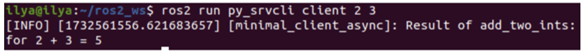
Вернитесь в терминал, где запущен ваш узел службы. Вы увидите, что он опубликовал сообщения журнала, когда получил запрос:
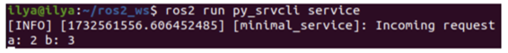
Вы создали два узла для запроса и ответа на данные через сервис, добавили их зависимости и исполняемые файлы в файлы конфигурации пакетов, чтобы можно было собрать и запустить их, что позволило вам увидеть систему сервиса/клиента в работе.

------------------------------------------------------------------------

## 2.8 Создание пользовательских файлов msg и srv

В предыдущих подразделах вы использовали интерфейсы сообщений и сервисов, чтобы узнать о темах, сервисах и простых узлах издатель/подписчик (C++/Python) и сервис/клиент (C++/Python). 
Хотя использование предопределенных определений интерфейсов является хорошей практикой, вам, вероятно, придется иногда определять собственные сообщения и службы. В этом уроке вы познакомитесь с простейшим методом создания собственных определений интерфейсов.Хотя использование предопределенных определений интерфейсов является хорошей практикой, вам, вероятно, придется иногда определять собственные сообщения и службы. В этом уроке вы познакомитесь с простейшим методом создания собственных определений интерфейсов.
В этом подразделе описано, как вы будете создавать пользовательские файлы `.msg` и `.srv` в отдельном пакете, а затем использовать их в отдельном пакете. Оба пакета должны находиться в одном рабочем пространстве.
Поскольку мы будем использовать пакеты pub/sub и service/client, созданные в предыдущих уроках, убедитесь, что вы находитесь в том же рабочем пространстве, что и эти пакеты (`ros2_ws/src`), а затем выполните следующую команду для создания нового пакета:
```bash
ros2 pkg create --build-type ament_cmake tutorial_interfaces
```
`tutorial_interfaces` — это имя нового пакета. Это может быть пакет CMake, но это не ограничивает, в каких типах пакетов вы можете использовать свои сообщения и сервисы. Вы можете создавать свои собственные интерфейсы в пакете CMake, а затем использовать их в узле C++ или Python, о чем будет рассказано в последнем разделе.
Файлы `.msg` и `.srv` должны быть помещены в каталоги с названиями `msg` и `srv` соответственно. Создайте эти каталоги в `ros2_ws/src/tutorial_interfaces`:
```bash
mkdir msg srv
```
Разберем создание пользовательских определений.
В только что созданном каталоге `tutorial_interfaces/msg` создайте новый файл `Num.msg` с одной строкой кода, объявляющей его структуру данных:
```
int64 num
```
Это пользовательское сообщение, передающее одно 64-битное целое число `num`.
Также в только что созданном каталоге `tutorial_interfaces/msg` создайте новый файл `Sphere.msg` со следующим содержимым:
```
geometry_msgs/Point center
float64 radius
```
Это пользовательское сообщение использует сообщение из другого пакета сообщений (в данном случае `geometry_msgs/Point`).
В директории `tutorial_interfaces/srv`, которую вы только что создали, создайте новый файл `AddThreeInts.srv` со следующей структурой запросов и ответов:
```
int64 a
int64 b
int64 c
---
int64 sum
```
Ваш пользовательский сервис, который запрашивает три целых числа с именами `a`, `b` и `c`, а в ответ получает целое число с именем `sum`.
Чтобы преобразовать определенные вами интерфейсы в код для конкретного языка (например, C++ и Python), чтобы их можно было использовать в этих языках, добавьте следующие строки в `CMakeLists.txt`:
```
find_package(geometry_msgs REQUIRED)
find_package(rosidl_default_generators REQUIRED)

rosidl_generate_interfaces(${PROJECT_NAME}
  "msg/Num.msg"
  "msg/Sphere.msg"
  "srv/AddThreeInts.srv"
  DEPENDENCIES geometry_msgs # Add packages that above messages depend on, in this case geometry_msgs for Sphere.msg
)
```
Поскольку интерфейсы полагаются на `rosidl_default_generators` для генерации кода, специфичного для данного языка, вам необходимо объявить зависимость от инструмента сборки. `rosidl_default_runtime` - это зависимость от времени выполнения или стадии выполнения, необходимая для последующего использования интерфейсов. `rosidl_interface_packages` - это имя группы зависимостей, с которой должен быть связан ваш пакет `tutorial_interfaces`, объявленное с помощью тега `<member_of_group>`.
Добавьте следующие строки в элемент `<package>` файла `package.xml`:
```xml
<depend>geometry_msgs</depend>
<buildtool_depend>rosidl_default_generators</buildtool_depend>
<exec_depend>rosidl_default_runtime</exec_depend>
<member_of_group>rosidl_interface_packages</member_of_group>
```
Теперь, когда все части вашего пакета пользовательских интерфейсов собраны, вы можете собрать пакет. В корне рабочей области (`~/ros2_ws`) выполните следующую команду:
```bash
colcon build --packages-select tutorial_interfaces
```
Теперь интерфейсы будут доступны другим пакетам ROS2.
Далее в новом терминале выполните следующую команду из рабочей области (`ros2_ws`), чтобы создать источник:
```bash
source install/setup.bash
```
Теперь вы можете убедиться, что создание интерфейса прошло успешно, используя команду `ros2 interface show`:
```bash
ros2 interface show tutorial_interfaces/msg/Num
```
Должно вернуться:
```
int64 num 
```
---
```bash
ros2 interface show tutorial_interfaces/msg/Sphere
```
```
geometry_msgs/Point center
        float64 x
        float64 y
        float64 z
float64 radius 
```
---
```
ros2 interface show tutorial_interfaces/srv/AddThreeInts
```
```
int64 a
int64 b
int64 c
---
int64 sum
```
Для тестирования новых интерфейсов вы можете использовать пакеты, созданные в предыдущих уроках. Несколько простых изменений в узлах, файлах `CMakeLists.txt` и `package.xml` позволят вам использовать новые интерфейсы.
Немного изменив пакет издателя/подписчика, созданный в предыдущем уроке (на C++ или Python), вы можете увидеть `Num.msg` в действии. Поскольку вы будете заменять стандартное строковое msg на числовое, вывод будет немного отличаться.

**Publisher**
```py
import rclpy
from rclpy.node import Node

from tutorial_interfaces.msg import Num    # CHANGE


class MinimalPublisher(Node):

    def __init__(self):
        super().__init__('minimal_publisher')
        self.publisher_ = self.create_publisher(Num, 'topic', 10)     # CHANGE
        timer_period = 0.5
        self.timer = self.create_timer(timer_period, self.timer_callback)
        self.i = 0

    def timer_callback(self):
        msg = Num()                                           # CHANGE
        msg.num = self.i                                      # CHANGE
        self.publisher_.publish(msg)
        self.get_logger().info('Publishing: "%d"' % msg.num)  # CHANGE
        self.i += 1


def main(args=None):
    rclpy.init(args=args)

    minimal_publisher = MinimalPublisher()

    rclpy.spin(minimal_publisher)

    minimal_publisher.destroy_node()
    rclpy.shutdown()


if __name__ == '__main__':
    main()
```
**Subscriber**
```py
import rclpy
from rclpy.node import Node

from tutorial_interfaces.msg import Num        # CHANGE


class MinimalSubscriber(Node):

    def __init__(self):
        super().__init__('minimal_subscriber')
        self.subscription = self.create_subscription(
            Num,                                              # CHANGE
            'topic',
            self.listener_callback,
            10)
        self.subscription

    def listener_callback(self, msg):
            self.get_logger().info('I heard: "%d"' % msg.num) # CHANGE


def main(args=None):
    rclpy.init(args=args)

    minimal_subscriber = MinimalSubscriber()

    rclpy.spin(minimal_subscriber)

    minimal_subscriber.destroy_node()
    rclpy.shutdown()


if __name__ == '__main__':
    main()
```
Добавьте следующую строку:
```
<exec_depend>tutorial_interfaces</exec_depend>
```
После внесения вышеуказанных правок и сохранения всех изменений соберите пакет:
```bash
colcon build --packages-select py_pubsub
```
Затем откройте два новых терминала, создайте источник ros2_ws в каждом из них и запустите:
```bash
ros2 run py_pubsub talker
ros2 run py_pubsub listener
```
Поскольку `Num.msg` передает только целое число, говорящий должен публиковать только целочисленные значения, а не строку, которую он публиковал ранее:
```bash
[INFO] [minimal_publisher]: Publishing: '0'
[INFO] [minimal_publisher]: Publishing: '1'
[INFO] [minimal_publisher]: Publishing: '2'
```
Далее проведем тестирование `AddThreeInts.srv` с помощью сервиса/клиента.
Немного изменив пакет сервиса/клиента, созданный в предыдущем уроке (на C++ или Python), вы можете увидеть `AddThreeInts.srv` в действии. Поскольку вы измените исходный двухцелочисленный запрос srv на трехцелочисленный, вывод будет немного отличаться.
**Service**
```py
from tutorial_interfaces.srv import AddThreeInts     # CHANGE

import rclpy
from rclpy.node import Node


class MinimalService(Node):

    def __init__(self):
        super().__init__('minimal_service')
        self.srv = self.create_service(AddThreeInts, 'add_three_ints', self.add_three_ints_callback)        # CHANGE

    def add_three_ints_callback(self, request, response):
        response.sum = request.a + request.b + request.c                                                  # CHANGE
        self.get_logger().info('Incoming request\na: %d b: %d c: %d' % (request.a, request.b, request.c)) # CHANGE

        return response

def main(args=None):
    rclpy.init(args=args)

    minimal_service = MinimalService()

    rclpy.spin(minimal_service)

    rclpy.shutdown()

if __name__ == '__main__':
    main()
```
**Client**
```py
from tutorial_interfaces.srv import AddThreeInts       # CHANGE
import sys
import rclpy
from rclpy.node import Node


class MinimalClientAsync(Node):

    def __init__(self):
        super().__init__('minimal_client_async')
        self.cli = self.create_client(AddThreeInts, 'add_three_ints')       # CHANGE
        while not self.cli.wait_for_service(timeout_sec=1.0):
            self.get_logger().info('service not available, waiting again...')
        self.req = AddThreeInts.Request()                                   # CHANGE

    def send_request(self):
        self.req.a = int(sys.argv[1])
        self.req.b = int(sys.argv[2])
        self.req.c = int(sys.argv[3])                  # CHANGE
        self.future = self.cli.call_async(self.req)


def main(args=None):
    rclpy.init(args=args)

    minimal_client = MinimalClientAsync()
    minimal_client.send_request()

    while rclpy.ok():
        rclpy.spin_once(minimal_client)
        if minimal_client.future.done():
            try:
                response = minimal_client.future.result()
            except Exception as e:
                minimal_client.get_logger().info(
                    'Service call failed %r' % (e,))
            else:
                minimal_client.get_logger().info(
                    'Result of add_three_ints: for %d + %d + %d = %d' %                               # CHANGE
                    (minimal_client.req.a, minimal_client.req.b, minimal_client.req.c, response.sum)) # CHANGE
            break

    minimal_client.destroy_node()
    rclpy.shutdown()


if __name__ == '__main__':
    main()
```
Затем откройте два новых терминала, создайте источник `ros2_ws` в каждом из них и запустите:
```bash
ros2 run py_srvcli client 2 3 1
```
В этом уроке вы узнали, как создавать пользовательские интерфейсы в собственном пакете и как использовать эти интерфейсы в других пакетах.

------------------------------------------------------------------------

## 2.9 Реализация пользовательских интерфейсов

В каталоге `src` рабочей области создайте пакет `more_interfaces` и выделите в нем каталог для msg-файлов:

```bash
ros2 pkg create --build-type ament_cmake --license Apache-2.0 more_interfaces
mkdir more_interfaces/msg
```
Внутри `more_interfaces/msg` создайте новый файл `AddressBook.msg` и вставьте в него следующий код, чтобы создать сообщение, предназначенное для передачи информации о человеке:
```bash
uint8 PHONE_TYPE_HOME=0
uint8 PHONE_TYPE_WORK=1
uint8 PHONE_TYPE_MOBILE=2

string first_name
string last_name
string phone_number
uint8 phone_type
```
Это сообщение состоит из следующих полей:
- first_name: типа string
- фамилия_имя: типа string
- номер_телефона: типа string
- phone_type: типа uint8, с несколькими определенными именованными константными значениями

Обратите внимание, что в определении сообщения можно задать значения по умолчанию для полей. Дополнительные способы настройки интерфейсов см. в разделе Интерфейсы.
Далее нам нужно убедиться, что файл msg превратился в исходный код для C++, Python и других языков.
Откройте файл `package.xml` и добавьте следующие строки:
```xml
<buildtool_depend>rosidl_default_generators</buildtool_depend>
<exec_depend>rosidl_default_runtime</exec_depend>
<member_of_group>rosidl_interface_packages</member_of_group>
```
Обратите внимание, что во время сборки нам нужны `rosidl_default_generators`, а во время выполнения - только `rosidl_default_runtime`.
Откройте `CMakeLists.txt`. Найдите пакет, который генерирует код сообщений из файлов msg/srv:
```php
find_package(rosidl_default_generators REQUIRED)
```
Объявите список сообщений, которые вы хотите сгенерировать:
```php
set(msg_files
  "msg/AddressBook.msg"
)
```
Добавляя .msg-файлы вручную, мы убеждаемся, что CMake знает, когда ему нужно переконфигурировать проект после добавления других .msg-файлов.
Сгенерируйте сообщения:
```php
rosidl_generate_interfaces(${PROJECT_NAME}
  ${msg_files}
)
```
Также убедитесь, что вы экспортировали зависимость времени выполнения сообщения:
```php
ament_export_dependencies(rosidl_default_runtime)
```
Теперь вы готовы сгенерировать исходные файлы из определения msg. Шаг компиляции мы пока пропустим, так как сделаем все вместе ниже.
Теперь мы можем начать писать код, который использует это сообщение.
В `more_interfaces/src` создайте файл `publish_address_book.cpp` и вставьте в него следующий код:
```cpp
#include <chrono>
#include <memory>

#include "rclcpp/rclcpp.hpp"
#include "more_interfaces/msg/address_book.hpp"
using namespace std::chrono_literals;
class AddressBookPublisher : public rclcpp::Node
{
public:
  AddressBookPublisher()
  : Node("address_book_publisher")
  {
    address_book_publisher_ =
      this->create_publisher<more_interfaces::msg::AddressBook>("address_book", 10);

    auto publish_msg = [this]() -> void {
        auto message = more_interfaces::msg::AddressBook();

        message.first_name = "John";
        message.last_name = "Doe";
        message.phone_number = "1234567890";
        message.phone_type = message.PHONE_TYPE_MOBILE;

        std::cout << "Publishing Contact\nFirst:" << message.first_name <<
          "  Last:" << message.last_name << std::endl;

        this->address_book_publisher_->publish(message);
      };
    timer_ = this->create_wall_timer(1s, publish_msg);
  }

private:
  rclcpp::Publisher<more_interfaces::msg::AddressBook>::SharedPtr address_book_publisher_;
  rclcpp::TimerBase::SharedPtr timer_;
};


int main(int argc, char * argv[])
{
  rclcpp::init(argc, argv);
  rclcpp::spin(std::make_shared<AddressBookPublisher>());
  rclcpp::shutdown();

  return 0;
}
```
Что он делает? Включение заголовка нашего только что созданного файла `AddressBook.msg`.
```cpp
#include "more_interfaces/msg/address_book.hpp"
```
Создание узла и издателя `AddressBook`.
```cpp
using namespace std::chrono_literals;

class AddressBookPublisher : public rclcpp::Node
{
public:
  AddressBookPublisher()
  : Node("address_book_publisher")
  {
    address_book_publisher_ =
      this->create_publisher<more_interfaces::msg::AddressBook>("address_book");
```
Создание обратного вызова для периодической публикации сообщений.
```cpp
auto publish_msg = [this]() -> void {
```
Создание экземпляра сообщения `AddressBook`, которое мы впоследствии опубликуем.
```cpp
auto message = more_interfaces::msg::AddressBook();
```
Заполнение полей Адресной книги.
```cpp
message.first_name = "John";
message.last_name = "Doe";
message.phone_number = "1234567890";
message.phone_type = message.PHONE_TYPE_MOBILE;
```
Периодическая отправка сообщений:
```cpp
std::cout << "Publishing Contact\nFirst:" << message.first_name <<
  "  Last:" << message.last_name << std::endl;

this->address_book_publisher_->publish(message);
```
Создаем 1-секундный таймер, который будет вызывать нашу функцию publish_msg каждую секунду.
```cpp
timer_ = this->create_wall_timer(1s, publish_msg);
```
Нам нужно создать новую цель для этого узла в файле `CMakeLists.txt`:
```cpp
find_package(rclcpp REQUIRED)

add_executable(publish_address_book src/publish_address_book.cpp)
ament_target_dependencies(publish_address_book rclcpp)

install(TARGETS
    publish_address_book
  DESTINATION lib/${PROJECT_NAME})
```
Чтобы использовать сообщения, сгенерированные в том же пакете, нам нужно использовать следующий код CMake:
```
rosidl_get_typesupport_target(cpp_typesupport_target
  ${PROJECT_NAME} rosidl_typesupport_cpp)
target_link_libraries(publish_address_book "${cpp_typesupport_target}")
```
Это позволяет найти соответствующий сгенерированный код C++ из `AddressBook.msg` и скомпоновать его.
Вы могли заметить, что этот шаг не требовался, когда используемые интерфейсы были из другого пакета, который был собран независимо. Этот код CMake требуется только в том случае, если вы хотите использовать интерфейсы из того же пакета, в котором они определены.
Вернитесь в корень рабочей области, чтобы собрать пакет:
```bash
cd ~/ros2_ws
colcon build --packages-up-to more_interfaces
```
Затем создайте рабочую область и запустите издателя:
```bash
source install/local_setup.bash
ros2 run more_interfaces publish_address_book
```
Вы должны увидеть, как издатель передает заданный вами msg, включая значения, установленные в `publish_address_book.cpp`.
Чтобы убедиться, что сообщение публикуется в теме `address_book`, откройте другой терминал, выберите источник рабочей области и вызовите `topic echo`:
```bash
source install/setup.bash
ros2 topic echo /address_book
```
В этом подразделе вы опробовали различные типы полей для определения интерфейсов, а затем создали интерфейс в том же пакете, в котором он используется. Вы также узнали, как использовать другой интерфейс в качестве типа поля, а также о том, какие документы `package.xml`, `CMakeLists.txt` и `#include` необходимы для использования этой возможности.

------------------------------------------------------------------------

## 2.10 Использование параметров ROS в классе Python

При создании собственных узлов иногда требуется добавить параметры, которые можно задать из файла запуска.
Откройте новый терминал и создайте исходники вашей системы ROS 2, чтобы команды `ros2` работали.

```bash
ros2 pkg create --build-type ament_python --license Apache-2.0 python_parameters --dependencies rclpy
```
Ваш терминал выдаст сообщение, подтверждающее создание пакета `python_parameters` и всех необходимых файлов и папок.
Аргумент `--dependencies` автоматически добавит необходимые строки зависимостей в `package.xml` и `CMakeLists.txt`.
Поскольку вы использовали опцию `--dependencies` при создании пакета, вам не нужно вручную добавлять зависимости в `package.xml` или `CMakeLists.txt`.
```xml
<description>Python parameter tutorial</description>
<maintainer email="you@email.com">Your Name</maintainer>
<license>Apache License 2.0</license>
```
Внутри каталога `ros2_ws/src/python_parameters/python_parameters` создайте новый файл `python_parameters_node.py` и вставьте в него следующий код:
```py
import rclpy
import rclpy.node

class MinimalParam(rclpy.node.Node):
    def __init__(self):
        super().__init__('minimal_param_node')

        self.declare_parameter('my_parameter', 'world')

        self.timer = self.create_timer(1, self.timer_callback)

    def timer_callback(self):
        my_param = self.get_parameter('my_parameter').get_parameter_value().string_value

        self.get_logger().info('Hello %s!' % my_param)

        my_new_param = rclpy.parameter.Parameter(
            'my_parameter',
            rclpy.Parameter.Type.STRING,
            'world'
        )
        all_new_parameters = [my_new_param]
        self.set_parameters(all_new_parameters)

def main():
    rclpy.init()
    node = MinimalParam()
    rclpy.spin(node)

if __name__ == '__main__':
    main()
```
Следующий фрагмент кода создает класс и конструктор. Строка `self.declare_parameter('my_parameter', 'world')` конструктора создает параметр с именем `my_parameter` и значением по умолчанию world. Тип параметра выводится из значения по умолчанию, поэтому в данном случае он будет установлен в тип string. Далее инициализируется `таймер` с периодом 1, что заставляет функцию `timer_callback` выполняться раз в секунду.
```py
class MinimalParam(rclpy.node.Node):
    def __init__(self):
        super().__init__('minimal_param_node')

        self.declare_parameter('my_parameter', 'world')

        self.timer = self.create_timer(1, self.timer_callback)
```
Первая строка функции `timer_callback` получает параметр `my_parameter` от узла и сохраняет его в `my_param`. Далее функция `get_logger` обеспечивает регистрацию события. Затем функция `set_parameters` устанавливает параметр `my_parameter` обратно в строковое значение по умолчанию `world`. В случае, если пользователь изменил параметр извне, это гарантирует, что он всегда будет возвращен к исходному значению.
```py
def timer_callback(self):
    my_param = self.get_parameter('my_parameter').get_parameter_value().string_value

    self.get_logger().info('Hello %s!' % my_param)

    my_new_param = rclpy.parameter.Parameter(
        'my_parameter',
        rclpy.Parameter.Type.STRING,
        'world'
    )
    all_new_parameters = [my_new_param]
    self.set_parameters(all_new_parameters)
```
За `timer_callback` следует наш `main`. Здесь инициализируется ROS 2, создается экземпляр класса `MinimalParam`, и `rclpy.spin` начинает обрабатывать данные с узла.
```py
def main():
    rclpy.init()
    node = MinimalParam()
    rclpy.spin(node)

if __name__ == '__main__':
    main()
```
Опционально можно задать дескриптор параметра. Дескрипторы позволяют указать текстовое описание параметра и его ограничения, например, сделать его доступным только для чтения, указать диапазон и т. д. Чтобы это работало, конструктор  `__init__` нужно изменить на:
```py
# ...

class MinimalParam(rclpy.node.Node):
    def __init__(self):
        super().__init__('minimal_param_node')

        from rcl_interfaces.msg import ParameterDescriptor
        my_parameter_descriptor = ParameterDescriptor(description='This parameter is mine!')

        self.declare_parameter('my_parameter', 'world', my_parameter_descriptor)

        self.timer = self.create_timer(1, self.timer_callback)

# ...
```
Чтобы добавить точку входа, откройте файл `setup.py`. Снова установите поля `maintainer`, `maintainer_email`, `description` и `license` в ваш `package.xml`:
```
maintainer='YourName',
maintainer_email='you@email.com',
description='Python parameter tutorial',
license='Apache License 2.0',

entry_points={
    'console_scripts': [
        'minimal_param_node = python_parameters.python_parameters_node:main',
    ],
},
```
Не забудьте сохранить.
Переходим к сборке и запуску. Перейдите в корень рабочей области, `ros2_ws`, и соберите новый пакет:
```bash
colcon build --packages-select python_parameters
```
Теперь запустите узел:
```
ros2 run python_parameters minimal_param_node
```
Терминал должен ежесекундно выдавать следующее сообщение:
```
[INFO] [parameter_node]: Hello world!
```
Теперь можно увидеть значение параметра по умолчанию, но если хочется иметь возможность задать его самостоятельно. Это можно сделать двумя способами.
Убедитесь, что узел запущен:
```
ros2 run python_parameters minimal_param_node
```
Откройте другой терминал, снова создайте файлы настроек внутри `ros2_ws` и введите следующую строку:
```
ros2 param list
```
Там вы увидите пользовательский параметр `my_parameter`. Чтобы изменить его, просто выполните следующую строку в консоли:
```
ros2 param set /minimal_param_node my_parameter earth
```
Вы знаете, что все прошло успешно, если получили вывод `Set parameter successful`. Если вы посмотрите на другой терминал, то увидите, что вывод изменился на `[INFO] [minimal_param_node]: Hello Earth!`
Поскольку после этого узел установил параметр обратно в `world`, дальнейший вывод показывает `[INFO] [minimal_param_node]: Hello world!`
Вы также можете задать параметры в файле запуска, но сначала вам нужно будет добавить каталог запуска. Внутри каталога `ros2_ws/src/python_parameters/` создайте новый каталог с именем `launch`. В ней создайте новый файл `python_parameters_launch.py`.
```py
from launch import LaunchDescription
from launch_ros.actions import Node

def generate_launch_description():
    return LaunchDescription([
        Node(
            package='python_parameters',
            executable='minimal_param_node',
            name='custom_minimal_param_node',
            output='screen',
            emulate_tty=True,
            parameters=[
                {'my_parameter': 'earth'}
            ]
        )
    ])
```
Здесь видно, что мы установили `my_parameter` в `earth` при запуске нашего узла `parameter_node`. Добавив две строки ниже, мы обеспечиваем вывод в консоль.
```py
output="screen",
emulate_tty=True,
```
Теперь откройте файл `setup.py`. Добавьте `import` в верхнюю часть файла, а также другое новое выражение к параметру `data_files`, чтобы включить все файлы запуска:
```py
import os
from glob import glob
# ...

setup(
  # ...
  data_files=[
      # ...
      (os.path.join('share', package_name), glob('launch/*launch.[pxy][yma]*')),
    ]
  )
```
Откройте консоль, перейдите в корень рабочей области, `ros2_ws`, и соберите новый пакет:
```
colcon build --packages-select python_parameters
```
Затем перейдите к файлам настроек в новом терминале:
```
source install/setup.bash
```
Теперь запустите узел с помощью файла запуска, который мы только что создали:
```
ros2 launch python_parameters python_parameters_launch.py
[INFO] [custom_minimal_param_node]: Hello earth!
```
Мы создали узел с пользовательским параметром, который может быть задан как из файла запуска, так и из командной строки. Добавили зависимости, исполняемые файлы и файл запуска в файлы конфигурации пакета, чтобы можно было собрать и запустить их и увидеть работу параметров.

------------------------------------------------------------------------

## 2.11 Использование ros2doctor для поиска проблем

Если ваша установка ROS2 работает не так, как ожидалось, вы можете проверить ее настройки с помощью инструмента ros2doctor.
ros2doctor проверяет все аспекты ROS2, включая платформу, версию, сеть, окружение, запущенные системы и многое другое, и предупреждает вас о возможных ошибках и причинах проблем.
Давайте проверим общую настройку ROS2 в целом с помощью `ros2doctor`. Для начала запустите ROS2 в новом терминале, затем введите команду:

``` 
ros2 doctor
```
В результате будут проверены все модули вашей установки и выданы предупреждения и ошибки.
Если ваша установка ROS2 находится в безупречном состоянии, то на экране появится сообщение, похожее на это:

```
All <n> checks passed
```
Однако нет ничего необычного в том, чтобы получить несколько предупреждений. Предупреждение `UserWarning` не означает, что ваша установка непригодна для использования; скорее всего, это просто признак того, что что-то настроено не идеально.
Если вы получите предупреждение, оно будет выглядеть примерно так:
```
<path>: <line>: UserWarning: <message>
```
Например, `ros2doctor` обнаружит это предупреждение, если вы используете нестабильный дистрибутив ROS2:
```
UserWarning: Distribution <distro> is not fully supported or tested. To get more consistent features, download a stable version at https://index.ros.org/doc/ros2/Installation/
```
Если `ros2doctor` находит в вашей системе только предупреждения, вы все равно получите сообщение `All <n> checks passed`.
Большинство проверок классифицируются как предупреждения, а не ошибки. В основном именно пользователь определяет важность информации, которую возвращает `ros2doctor`. Если проверка обнаружит редкую ошибку в вашей настройке, на которую указывает `UserWarning: ERROR:`, проверка считается неудачной.
Вы увидите сообщение, похожее на следующий список отзывов о проблемах:
```
1/3 checks failed
Failed modules:  network
```
Ошибка указывает на то, что в системе отсутствуют важные настройки или функции, имеющие решающее значение для ROS2. Чтобы система функционировала должным образом, необходимо устранить ошибки.
Вы также можете проверить работающую систему ROS2, чтобы выявить возможные причины проблем. Чтобы увидеть, как `ros2doctor` работает на работающей системе, давайте запустим turtlesim, в котором узлы активно общаются друг с другом.
Запустите систему, открыв новый терминал, выбрав ROS 2 и введя команду:
```
ros2 run turtlesim turtlesim_node
```
Откройте другой терминал и запустите ROS 2, чтобы запустить teleop controls:
```
ros2 run turtlesim turtle_teleop_key
```
Теперь снова запустите `ros2doctor` в отдельном терминале. Вы увидите предупреждения и ошибки, которые были в прошлый раз, когда вы запускали `ros2doctor` на своей установке, если они были. Вслед за ними появится несколько новых предупреждений, относящихся к самой системе:
UserWarning: Publisher without subscriber detected on /turtle1/color_sensor.
UserWarning: Publisher without subscriber detected on /turtle1/pose.
Похоже, что узел `/turtlesim` публикует данные в два топика, на которые никто не подписан, и ros2doctor считает, что это может привести к проблемам.
Если вы выполните команды для эха топиков `/color_sensor` и `/pose`, эти предупреждения исчезнут, потому что у издателей появятся подписчики.
Вы можете попробовать это сделать, открыв два новых терминала при запущенном turtlesim, запустив в каждом из них ROS2 и выполнив каждую из следующих команд в своем терминале:
```
ros2 topic echo /turtle1/color_sensor
ros2 topic echo /turtle1/pose
```
Затем снова запустите `ros2doctor`. Предупреждения `publisher without subscriber` исчезнут. (Не забудьте после ввести `Ctrl+C` в терминалах, где вы запускали echo).
Теперь попробуйте выйти из окна turtlesim или выйти из teleop и снова запустить `ros2doctor`. Вы увидите больше предупреждений, указывающих на `publisher without subscriber` или `ubscriber without publisher` для различных топиков, теперь, когда один узел в системе недоступен.
В сложной системе с большим количеством узлов ros2doctor будет неоценим для выявления возможных причин проблем со связью.
Хотя `ros2doctor` позволит вам узнать предупреждения о вашей сети, системе и т. д., запуск его с аргументом `--report` даст вам гораздо больше деталей, которые помогут вам проанализировать проблемы.
Вы можете использовать `--report`, если получите предупреждение о настройках сети и захотите выяснить, какая именно часть вашей конфигурации вызывает предупреждение.
Чтобы получить полный отчет, введите в терминале следующую команду:
```
ros2 doctor --report
```
В результате вы получите список информации, разделенной на пять групп:
```
NETWORK CONFIGURATION
...

PLATFORM INFORMATION
...
RMW MIDDLEWARE
...
ROS 2 INFORMATION
...
TOPIC LIST
...
```
Вы можете сверить информацию, содержащуюся здесь, с предупреждениями, которые вы получаете при запуске `ros2 doctor`. Например, если `ros2doctor` выдал предупреждение (упомянутое ранее) о том, что ваш дистрибутив «не полностью поддерживается или протестирован», вы можете взглянуть на раздел отчета `ROS2 INFORMATION`:
```
distribution name      : <distro>
distribution type      : ros2
distribution status    : prerelease
release platforms      : {'<platform>': ['<version>']}
```
Здесь вы можете увидеть, что `distribution status` - `prerelease`, что объясняет, почему он не полностью поддерживается.
Для ros2 humble `distribution status` будет `active`.
Итак, `ros2doctor` будет сообщать вам о проблемах в установленной и работающей системе ROS2. С помощью аргумента `--report` вы можете получить более подробную информацию, скрывающуюся за этими предупреждениями.

------------------------------------------------------------------------

## 3 Повышенный уровень

Данный раздел посвящён инструментам и концепциям, которые обычно нужны после освоения основ: управление зависимостями через rosdep, создание и использование пользовательских интерфейсов (msg/srv), а также работа с действиями (actions), включая создание .action и реализацию action server/client.

## 3.1 Управление зависимостями с помощью rosdep

`rosdep` — это утилита управления зависимостями, которая может работать с пакетами и внешними библиотеками. Она является утилитой командной строки для определения и установки зависимостей для сборки или установки пакета. `rosdep` не является самостоятельным менеджером пакетов; это мета-менеджер пакетов, который использует свои собственные знания о системе и зависимостях для поиска подходящего пакета для установки на конкретную платформу. Фактическая установка выполняется с помощью системного менеджера пакетов (например, `apt` в Ubuntu).
Чаще всего его вызывают перед сборкой рабочего пространства, где он используется для установки зависимостей пакетов, входящих в это рабочее пространство.
Он может работать как с одним пакетом, так и с каталогом пакетов (например, с рабочим пространством).
Файл `package.xml` — это файл в вашем программном обеспечении, в котором `rosdep` находит набор зависимостей. Важно, чтобы список зависимостей в `package.xml` был полным и корректным, что позволит всем инструментам определять зависимости пакетов. Отсутствие или некорректность зависимостей может привести к тому, что пользователи не смогут использовать ваш пакет, пакеты в рабочем пространстве будут собраны не по порядку или не смогут быть выпущены.
Зависимости в файле `package.xml` обычно называются «ключами rosdep». Эти зависимости вносятся в файл `package.xml` вручную создателями пакета и должны представлять собой полный список всех библиотек и пакетов, не требующих сборки.
Они представлены в следующих тегах:
- `<depend>`
    Это зависимости, которые должны быть предоставлены как во время сборки, так и во время выполнения вашего пакета. Для пакетов C++, если есть сомнения, используйте этот тег. Пакеты на чистом Python обычно не имеют фазы сборки, поэтому никогда не следует использовать этот тег, а вместо него следует использовать `<exec_depend>`.
- `<build_depend>`
    Если вы используете определенную зависимость только для сборки вашего пакета, а не во время выполнения, вы можете использовать тег `<build_depend>`.
    При таком типе зависимости установленный двоичный файл вашего пакета не требует установки этого конкретного пакета.
    Однако может возникнуть проблема, если ваш пакет экспортирует заголовок, который включает заголовок из этой зависимости. В этом случае вам также понадобится `<build_export_depend>`.
- `<build_export_depend>`
    Если вы экспортируете заголовок, включающий заголовок из зависимости, он будет необходим другим пакетам, которые  зависят через `<build_depend>` от вашего. В основном это относится к заголовкам и конфигурационным файлам CMake. Пакеты библиотек, на которые ссылаются экспортируемые вами библиотеки, обычно должны быть указаны в `<depend>`, поскольку они также необходимы во время выполнения.
- `<exec_depend>`
    Этот тег объявляет зависимости для разделяемых библиотек, исполняемых файлов, модулей Python, сценариев запуска и других файлов, необходимых при запуске вашего пакета.
- `<test_depend>`
    Этот тег объявляет зависимости, необходимые только для тестов. Зависимости здесь *не* должны дублироваться с ключами, указанными в `<build_depend>`, `<exec_depend>` или `<depend>`.

Как работает rosdep? `rosdep` проверяет файлы `package.xml` в своем пути или для конкретного пакета и находит хранящиеся в них ключи rosdep. Затем эти ключи сверяются с центральным индексом для поиска соответствующего пакета ROS или программной библиотеки в различных менеджерах пакетов. Наконец, когда пакеты найдены, они устанавливаются и становятся готовыми к работе. `rosdep` работает, получая центральный индекс на вашей локальной машине, чтобы не обращаться к сети при каждом запуске.
Центральный индекс известен как `rosdistro`, который можно найти в Интернете.
Если пакет, от которого вы хотите создать зависимость, основан на ROS И был выпущен в экосистеме ROS, например, `nav2_bt_navigator`, вы можете просто использовать имя пакета. Список всех выпущенных пакетов ROS можно найти в [https://github.com/ros/rosdistro](https://github.com/ros/rosdistro) в файле `humble/distribution.yaml`. Если вам нужна зависимость от пакета, не связанного с ROS (так называемые "системные зависимости"), вам потребуется найти ключи для конкретной библиотеки. В общем случае, есть два важных файла:
-	rosdep/base.yaml содержит системные зависимости,
-	rosdep/python.yaml содержит зависимости Python.

Чтобы найти ключ, выполните поиск вашей библиотеки в этих файлах и найдите её имя. Это и будет ключ, который нужно указать в файле `package.xml`.
Например, представим, что у пакета есть зависимость от `doxygen`, потому что это программное обеспечение, которое заботится о качественной документации. Мы бы искали `doxygen` в `rosdep/base.yaml` и нашли бы:

```
doxygen:
  arch: [doxygen]
  debian: [doxygen]
  fedora: [doxygen]
  freebsd: [doxygen]
  gentoo: [app-doc/doxygen]
  macports: [doxygen]
  nixos: [doxygen]
  openembedded: [doxygen@meta-oe]
  opensuse: [doxygen]
  rhel: [doxygen]
  ubuntu: [doxygen]
```
Это означает, что наш ключ rosdep - `doxygen`, который будет преобразовываться в эти различные имена в менеджерах пакетов различных операционных систем для установки.
Если вы используете `rosdep` с ROS, он удобно поставляется вместе с дистрибутивом ROS. Это рекомендуемый способ получения `rosdep`. Вы можете установить его с помощью:

```bash
apt-get install python3-rosdep
```
В Ubuntu есть другой пакет с похожим названием - `python3-rosdep2`. Если этот пакет установлен, убедитесь, что удалили его перед установкой `python3-rosdep`.
Теперь, когда мы имеем некоторое понимание `rosdep`, `package.xml` и `rosdistro`, мы готовы использовать саму утилиту! Во-первых, если вы используете `rosdep` впервые, его необходимо инициализировать:
```bash
sudo rosdep init
rosdep update
```
Это инициализирует rosdep, а команда `update` обновит локально кэшированный индекс rosdistro. Рекомендуется периодически выполнять `update` для получения последней версии.
Наконец, мы можем запустить `rosdep install` для установки зависимостей. Обычно это выполняется для рабочего пространства с несколькими пакетами одной командой для установки всех зависимостей. Если вы находитесь в корне рабочего пространства с директорией `src`, содержащей исходный код, команда будет выглядеть так:
```bash
rosdep install --from-paths src -y --ignore-src
```
Разберем параметры:
* `--from-paths src` указывает путь для поиска файлов `package.xml`, по которым будут определяться ключи
* `-y` означает автоматический ответ "да" на все запросы менеджера пакетов для установки без подтверждений
* `--ignore-src` означает игнорирование установки зависимостей, даже если существует ключ rosdep, если сам пакет также находится в рабочем пространстве.

------------------------------------------------------------------------

## 3.2 Создание действия

Этот подраздел покажет вам, как определить и создать действие, которое вы сможете использовать с сервером действий и клиентом действий, о которых пойдет речь в следующем учебнике. Предварительные требования: у вас должны быть установлены ROS 2 и colcon.
Настройте рабочее пространство и создайте пакет с именем `action_tutorials_interfaces`:
```bash
mkdir -p ros2_ws/src # вы можете использовать существующее рабочее пространство с этой системой именования
cd ros2_ws/src
ros2 pkg create action_tutorials_interfaces
```
Действия определяются в файлах `.action` следующего формата:
```
# Запрос
---
# Результат
---
# Обратная связь
```
Определение действия состоит из трех определений сообщений, разделенных `---`.
-	сообщение *запроса* отправляется от клиента действий к серверу действий для инициирования новой цели,
-	сообщение *результата* отправляется от сервера действий к клиенту действий, когда цель достигнута,
-	сообщения *обратной связи* периодически отправляются от сервера действий к клиенту действий с обновлениями о состоянии цели.

Экземпляр действия обычно называется *целью*.
Допустим, мы хотим определить новое действие "Фибоначчи" для вычисления последовательности Фибоначчи.
Создайте директорию `action` в нашем пакете ROS 2 `action_tutorials_interfaces`:
```bash
cd action_tutorials_interfaces
mkdir action
```
В директории `action` создайте файл с именем `Fibonacci.action` со следующим содержимым:
```
int32 order
---
int32[] sequence
---
int32[] partial_sequence
```
Запрос цели — это последовательность Фибоначчи `order`, которую мы хотим вычислить, результат — это окончательная последовательность `sequence`, а обратная связь — это частичная последовательность `partial_sequence`, вычисленная на данный момент.
Прежде чем мы сможем использовать новый тип действия в нашем коде, мы должны передать определение в конвейер генерации кода ROS IDL. Это достигается путем добавления следующих строк в наш `CMakeLists.txt` перед строкой `ament_package()`, в пакете `action_tutorials_interfaces`:
```php
find_package(rosidl_default_generators REQUIRED)
rosidl_generate_interfaces(${PROJECT_NAME}
  "action/Fibonacci.action"
)
```
Мы также должны добавить необходимые зависимости в наш `package.xml`:
```xml
<buildtool_depend>rosidl_default_generators</buildtool_depend>
<depend>action_msgs</depend>

<member_of_group>rosidl_interface_packages</member_of_group>
```
Обратите внимание, что нам нужно зависеть от `action_msgs`, так как определения действий включают дополнительные метаданные (например, идентификаторы целей).
Теперь мы должны иметь возможность создать пакет, содержащий определение действия "Фибоначчи":

```bash
# Перейдите в корневую директорию рабочего пространства
cd ~/ros2_ws
# Build
colcon build
```
По соглашению, типы действий будут префиксироваться их пакетом и словом `action`. Таким образом, когда мы хотим сослаться на наше новое действие, оно будет иметь полный имя `action_tutorials_interfaces/action/Fibonacci`.
Мы можем проверить, успешно ли создано действие, с помощью командной строки:
```bash
# Исходный код нашего рабочего пространства
. install/setup.bash
# Проверьте, существует ли наше определение действия
ros2 interface show action_tutorials_interfaces/action/Fibonacci
```
Вы должны увидеть определение действия Фибоначчи, напечатанное на экране.

------------------------------------------------------------------------

## 3.3 Написание сервера и клиента действий на Python

Давайте сосредоточимся на написании сервера действий, который вычисляет последовательность Фибоначчи, используя действие, которое мы создали ранее.
До этого вы создавали пакеты и использовали `ros2 run` для запуска узлов. Однако, чтобы упростить этот туториал, мы ограничим сервер действий одним файлом.
Создайте новый файл в вашем домашнем каталоге, назовем его `fibonacci_action_server.py`, и добавьте следующий код:
```py
import rclpy
from rclpy.action import ActionServer
from rclpy.node import Node

from action_tutorials_interfaces.action import Fibonacci


class FibonacciActionServer(Node):

    def __init__(self):
        super().__init__('fibonacci_action_server')
        self._action_server = ActionServer(
            self,
            Fibonacci,
            'fibonacci',
            self.execute_callback)

    def execute_callback(self, goal_handle):
        self.get_logger().info('Executing goal...')
        result = Fibonacci.Result()
        return result


def main(args=None):
    rclpy.init(args=args)

    fibonacci_action_server = FibonacciActionServer()

    rclpy.spin(fibonacci_action_server)

if __name__ == '__main__':
    main()
```
Строка 8 определяет класс `FibonacciActionServer`, который является подклассом `Node`. Класс инициализируется вызовом конструктора `Node`, называя наш узел `fibonacci_action_server`:
```py
super().__init__('fibonacci_action_server')
```
В конструкторе мы также создаем экземпляр нового сервера действий:
```py
self._action_server = ActionServer(
            self,
            Fibonacci,
            'fibonacci',
            self.execute_callback)
```
Сервер действий требует четырех аргументов:
1.	Узел ROS 2, к которому нужно добавить клиент действий: `self`.
2.	Тип действия: `Fibonacci` (импортированный в строке 5)
3.	Имя действия: `'fibonacci'`.
4.	 Функция обратного вызова для выполнения принятых целей: `self.execute_callback`. Этот callback **должен** возвращать сообщение с результатом для данного типа действия.

Мы также определяем метод `execute_callback` в нашем классе:
```py
    def execute_callback(self, goal_handle):
        self.get_logger().info('Executing goal...')
        result = Fibonacci.Result()
        return result
```
Это метод, который будет вызываться для выполнения цели после ее принятия.
Давайте попробуем запустить наш сервер действий:
```bash
ros2 action send_goal fibonacci action_tutorials_interfaces/action/Fibonacci "{order: 5}"
```
Мы можем использовать метод `succeed()` у цели для указания, что цель была успешной:
```py
    def execute_callback(self, goal_handle):
        self.get_logger().info('Executing goal...')
        goal_handle.succeed()
        result = Fibonacci.Result()
        return result
```
Теперь, если вы перезапустите сервер действий и отправите другую цель, вы должны увидеть, что цель завершилась со статусом `SUCCEEDED`.
Теперь давайте сделаем так, чтобы наше выполнение цели действительно вычисляло и возвращало запрошенную последовательность Фибоначчи:
```py
    def execute_callback(self, goal_handle):
        self.get_logger().info('Executing goal...')

        sequence = [0, 1]

        for i in range(1, goal_handle.request.order):
            sequence.append(sequence[i] + sequence[i-1])

        goal_handle.succeed()

        result = Fibonacci.Result()
        result.sequence = sequence
        return result
```
После вычисления последовательности мы присваиваем её полю сообщения результата перед возвратом.
Снова перезапустите сервер действий и отправьте другую цель. Вы должны увидеть, что цель завершается с правильной последовательностью результата.
Одна из хороших особенностей действий — это возможность предоставлять обратную связь клиенту действия во время выполнения цели. Мы можем сделать так, чтобы наш сервер действий публиковал обратную связь для клиентов действий, вызывая метод `publish_feedback()` у обработчика цели.
Мы заменим переменную `sequence` и вместо неё будем использовать сообщение обратной связи для хранения последовательности. После каждого обновления сообщения обратной связи в цикле for мы публикуем сообщение обратной связи и делаем паузу:
```py
import time

import rclpy
from rclpy.action import ActionServer
from rclpy.node import Node

from action_tutorials_interfaces.action import Fibonacci


class FibonacciActionServer(Node):

    def __init__(self):
        super().__init__('fibonacci_action_server')
        self._action_server = ActionServer(
            self,
            Fibonacci,
            'fibonacci',
            self.execute_callback)

    def execute_callback(self, goal_handle):
        self.get_logger().info('Executing goal...')

        feedback_msg = Fibonacci.Feedback()
        feedback_msg.partial_sequence = [0, 1]

        for i in range(1, goal_handle.request.order):
            feedback_msg.partial_sequence.append(
                feedback_msg.partial_sequence[i] + feedback_msg.partial_sequence[i-1])
            self.get_logger().info('Feedback: {0}'.format(feedback_msg.partial_sequence))
            goal_handle.publish_feedback(feedback_msg)
            time.sleep(1)

        goal_handle.succeed()

        result = Fibonacci.Result()
        result.sequence = feedback_msg.partial_sequence
        return result


def main(args=None):
    rclpy.init(args=args)

    fibonacci_action_server = FibonacciActionServer()

    rclpy.spin(fibonacci_action_server)


if __name__ == '__main__':
    main()
```
После перезапуска сервера действий мы можем подтвердить, что обратная связь теперь публикуется, используя инструмент командной строки с опцией `--feedback`:
```bash
ros2 action send_goal --feedback fibonacci action_tutorials_interfaces/action/Fibonacci "{order: 5}"
```
Мы также ограничим клиент действий одним файлом. Откройте новый файл, назовем его `fibonacci_action_client.py`, и добавьте следующий код:

```py
import rclpy
from rclpy.action import ActionClient
from rclpy.node import Node

from action_tutorials_interfaces.action import Fibonacci


class FibonacciActionClient(Node):

    def __init__(self):
        super().__init__('fibonacci_action_client')
        self._action_client = ActionClient(self, Fibonacci, 'fibonacci')

    def send_goal(self, order):
        goal_msg = Fibonacci.Goal()
        goal_msg.order = order

        self._action_client.wait_for_server()

        return self._action_client.send_goal_async(goal_msg)


def main(args=None):
    rclpy.init(args=args)

    action_client = FibonacciActionClient()

    future = action_client.send_goal(10)

    rclpy.spin_until_future_complete(action_client, future)


if __name__ == '__main__':
    main()
```
Мы определили класс `FibonacciActionClient`, который является подклассом `Node`. Класс инициализируется вызовом конструктора `Node`, называя наш узел `fibonacci_action_client`:
```py
        super().__init__('fibonacci_action_client')
```
Также в конструкторе класса мы создаем клиент действий, используя пользовательское определение действия из предыдущего туториала по созданию действия:
```py
        self._action_client = ActionClient(self, Fibonacci, 'fibonacci')
```
Мы создаем `ActionClient`, передавая ему три аргумента:
-	узел ROS 2, к которому нужно добавить клиент действий: `self`,
-	тип действия: `Fibonacci`,
-	имя действия: `'fibonacci'`.

Наш клиент действий сможет взаимодействовать с серверами действий того же имени и типа действия. Мы также определяем метод `send_goal` в классе `FibonacciActionClient`:

```py
    def send_goal(self, order):
        goal_msg = Fibonacci.Goal()
        goal_msg.order = order
        self._action_client.wait_for_server()
        return self._action_client.send_goal_async(goal_msg)
```
Этот метод ожидает, пока сервер действий станет доступным, затем отправляет цель на сервер.
После определения класса мы определяем функцию `main()`, которая инициализирует ROS 2 и создает экземпляр нашего узла `FibonacciActionClient`. Затем она отправляет цель и ждет, пока эта цель не будет завершена.
Наконец, мы вызываем `main()` в точке входа нашей Python-программы.
Давайте протестируем наш клиент действий, сначала запустив ранее созданный сервер действий:
```bash
python3 fibonacci_action_server.py
```
В другом терминале запустите клиент действий:
```bash
python3 fibonacci_action_client.py
```
Вы должны увидеть сообщения, напечатанные сервером действий, когда он успешно выполняет цель.
Клиент действий должен запуститься и быстро завершиться. На этом этапе у нас есть функционирующий клиент действий, но мы не видим никаких результатов или обратных связей.
Мы можем получить информацию о результате с помощью нескольких шагов. Во-первых, нам нужно получить цель для цели, которую мы отправили. Затем мы можем использовать цель для запроса результата.
Вот полный код для этого примера:
```py
import rclpy
from rclpy.action import ActionClient
from rclpy.node import Node

from action_tutorials_interfaces.action import Fibonacci


class FibonacciActionClient(Node):

    def __init__(self):
        super().__init__('fibonacci_action_client')
        self._action_client = ActionClient(self, Fibonacci, 'fibonacci')

    def send_goal(self, order):
        goal_msg = Fibonacci.Goal()
        goal_msg.order = order

        self._action_client.wait_for_server()

        self._send_goal_future = self._action_client.send_goal_async(goal_msg)

        self._send_goal_future.add_done_callback(self.goal_response_callback)

    def goal_response_callback(self, future):
        goal_handle = future.result()
        if not goal_handle.accepted:
            self.get_logger().info('Goal rejected :(')
            return

        self.get_logger().info('Goal accepted :)')

        self._get_result_future = goal_handle.get_result_async()
        self._get_result_future.add_done_callback(self.get_result_callback)

    def get_result_callback(self, future):
        result = future.result().result
        self.get_logger().info('Result: {0}'.format(result.sequence))
        rclpy.shutdown()


def main(args=None):
    rclpy.init(args=args)

    action_client = FibonacciActionClient()

    action_client.send_goal(10)

    rclpy.spin(action_client)


if __name__ == '__main__':
    main()
```
Метод `ActionClient.send_goal_async()` возвращает future для цели. Сначала мы регистрируем callback для случая, когда future завершено:
```py
self._send_goal_future.add_done_callback(self.goal_response_callback)
```
Обратите внимание, что future завершается, когда сервер действий принимает или отклоняет запрос на выполнение цели. Давайте подробнее рассмотрим `goal_response_callback`. Мы можем проверить, была ли цель отклонена, и закончить раньше, так как знаем, что результата не будет:
```py
    def goal_response_callback(self, future):
        goal_handle = future.result()
        if not goal_handle.accepted:
            self.get_logger().info('Goal rejected :(')
            return

        self.get_logger().info('Goal accepted :)')
```
Теперь, когда мы получили цель, мы можем использовать её для запроса результата с помощью метода `get_result_async()`. Аналогично отправке цели, мы получим `future`, которое завершится, когда результат будет готов. Давайте зарегистрируем `callback`, как мы делали для ответа на цель:
```py
        self._get_result_future = goal_handle.get_result_async()
        self._get_result_future.add_done_callback(self.get_result_callback)
```
В callback-функции мы записываем последовательность результата и завершаем ROS 2 для чистого выхода:
```py
    def get_result_callback(self, future):
        result = future.result().result
        self.get_logger().info('Result: {0}'.format(result.sequence))
        rclpy.shutdown()
```
С сервером действий, работающим в отдельном терминале, попробуйте запустить наш клиент действий.
Вы должны увидеть сообщения о том, что цель была принята и конечный результат.
Давайте получим некоторую обратную связь о целях, которые мы отправляем на сервер действий.
```py
import rclpy
from rclpy.action import ActionClient
from rclpy.node import Node

from action_tutorials_interfaces.action import Fibonacci


class FibonacciActionClient(Node):

    def __init__(self):
        super().__init__('fibonacci_action_client')
        self._action_client = ActionClient(self, Fibonacci, 'fibonacci')

    def send_goal(self, order):
        goal_msg = Fibonacci.Goal()
        goal_msg.order = order

        self._action_client.wait_for_server()

        self._send_goal_future = self._action_client.send_goal_async(goal_msg, feedback_callback=self.feedback_callback)

        self._send_goal_future.add_done_callback(self.goal_response_callback)

    def goal_response_callback(self, future):
        goal_handle = future.result()
        if not goal_handle.accepted:
            self.get_logger().info('Goal rejected :(')
            return

        self.get_logger().info('Goal accepted :)')

        self._get_result_future = goal_handle.get_result_async()
        self._get_result_future.add_done_callback(self.get_result_callback)

    def get_result_callback(self, future):
        result = future.result().result
        self.get_logger().info('Result: {0}'.format(result.sequence))
        rclpy.shutdown()

    def feedback_callback(self, feedback_msg):
        feedback = feedback_msg.feedback
        self.get_logger().info('Received feedback: {0}'.format(feedback.partial_sequence))


def main(args=None):
    rclpy.init(args=args)

    action_client = FibonacciActionClient()

    action_client.send_goal(10)

    rclpy.spin(action_client)


if __name__ == '__main__':
    main()
```
Вот функция обратного вызова для обработки сообщений обратной связи:
```py
    def feedback_callback(self, feedback_msg):
        feedback = feedback_msg.feedback
        self.get_logger().info('Received feedback: {0}'.format(feedback.partial_sequence))
```
В callback-функции мы получаем часть сообщения с обратной связью и выводим поле `partial_sequence` на экран.
Нам нужно зарегистрировать callback-функцию с клиентом действий. Это достигается путем дополнительной передачи callback-функции клиенту действий, когда мы отправляем цель:

```py
        self._send_goal_future = self._action_client.send_goal_async(goal_msg, feedback_callback=self.feedback_callback)
```
Теперь, если мы запустим наш клиент действий, вы должны увидеть, что обратная связь выводится на экран.

------------------------------------------------------------------------

## Заключение

В рамках работы последовательно рассмотрены инструменты командной строки ROS 2, базовые концепции графа ROS, разработка пакетов и узлов на C++ и Python, а также расширенные темы: пользовательские интерфейсы сообщений/сервисов, действия, управление зависимостями rosdep и диагностика ros2doctor.
Практическая ценность материала заключается в том, что каждый раздел содержит воспроизводимые команды и листинги кода, которые можно использовать как шаблоны при разработке реальных робототехнических приложений.
Для закрепления рекомендуется: 
1. повторить запуск turtlesim и исследование графа, 
2. собрать минимум два пакета (C++ и Python), 
3. реализовать собственные msg/srv/action интерфейсы, 
4. протестировать запись и воспроизведение ros2 bag, 
5. выполнить диагностику ros2doctor на чистой установке и на работающей системе.

Перед выполнением приведённых ниже команд необходимо понимать общий принцип их использования. ROS 2 строится как распределённая система, где каждая команда командной строки или фрагмент кода влияет на состояние графа ROS: регистрацию узлов, установление соединений, инициализацию интерфейсов и обмен сообщениями.

 Поэтому данные инструкции следует выполнять последовательно, контролируя вывод в терминале и текущее состояние системы.
